# Reference: Morrison, K., Yang, Y., Williams, C. et al. Mapping meta-analyses on organochlorine pesticides reveals low methodological quality. Nat Sustain (2025). https://doi.org/10.1038/s41893-025-01634-5

In this Rmarkdown document we provide the following workflow:   

- Section 0: To examine the volume and temporal trends of existing meta-analyses on the effects of organochlorine pesticides

- Section 1: To evaluate the methodological patterns and quality of existing meta-analyses studying the effects of organochlorine pesticides.

- Section 2: To explore the various characteristics of the organochlorine pesticides literature such as the pesticides used, the impacts elicited in response and the subjects that were investigated.

- Section 3: To investigate the research outputs across different countries, continents and disciplines, and investigate the degree of cross-country collaboration.
 

# Load packages and data
## Load packages 

```r
rm(list = ls())
pacman::p_load(tidyverse,
hrbrthemes, 
patchwork,
here,
stringr,
knitr,
formatR,
forcats,
ggplot2,
bibliometrix,
ordinal,
igraph,
stringi,
stringdist,
circlize,
ggalluvial,
ggraph,
ComplexUpset)
knitr::opts_chunk$set(echo = TRUE, message = FALSE, warning = FALSE)
```


## Load data
Manually extracted pilot data is stored in five separate **.csv** files representing different aspects of the data (extracted via structured predefined Google Forms - one per table). 
Bibliographic data records are exported from Scopus (including cited references field) in .bib format and locally saved as **bib_sco.bib**. 

```r
# Load CSV datasets
sd <- read_csv(here("data", "ocp_srm_study_details.csv"))
ocp <- read_csv(here("data", "ocp_srm_ocp_details.csv"))
sub <- read_csv(here("data", "ocp_srm_subject_details.csv"))
im <- read_csv(here("data", "ocp_srm_impact_details.csv"))
sp <- read_csv(here("data", "ocp_srm_species_details.csv"))
pol <- read_csv(here("data", "ocp_srm_policy.csv"))
# Load BibTeX dataset
bib_sco <- convert2df(here("data", "bib_sco.bib"), dbsource = "scopus", format = "bibtex")
```

# Section 0 
To examine the volume and temporal trends of existing meta-analyses on the effects of organochlorine pesticides

## Figure 1 
A) Bar chart showing the annual number of meta-analyses synthesising research on the impacts of organochlorine pesticides, categorised by different subjects of exposure. 
B) Area graph showing the cumulative time trends of meta-analyses synthesising research on the impacts of organochlorine pesticides, categorised by different subjects of exposure.
C) Bar chart showing the annual number of policy citations on the included meta-analysis analyses synthesising research on the impacts of organochlorine pesticides, categorised by policy topics
D) Area graph showing the cumulative time trends of policy citations on the included meta-analysis analyses synthesising research on the impacts of organochlorine pesticides, categorised by policy topics

```r
# Join the study and subject datasets
sd_sub <- left_join(sd, sub, by = "study_id")

# Count the number of publications per year and calculate cumulative sum
sd1 <- sd %>%
  count(publication_year) %>%
  mutate(n_cumulative = cumsum(n))

# Custom theme ensuring consistent formatting
theme_count <- function() {
  theme_minimal() +
    theme(
      panel.grid.major.y = element_line(color = "gray", linetype = "dashed"),
      panel.grid.minor.y = element_blank(),
      axis.line.x      = element_line(size = 1.2),
      axis.line.y      = element_line(size = 1.2),
      axis.title.x     = element_text(size = 20),
      axis.title.y     = element_text(size = 20),
      axis.text.x      = element_text(angle = 45, hjust = 1,
                                      size = 15, color = "#666666"),
      axis.text.y      = element_text(size = 20, color = "#666666"),
      legend.position  = "none",
      # ⇩ Tag styling added here
      plot.tag         = element_text(size = 20, face = "bold")
    )
}

# Set fixed year range
min_year <- 1993
max_year <- 2022

fig1a <- sd_sub %>%
  mutate(subjects = strsplit(subject, ",\\s+")) %>%
  unnest(subjects) %>%
  count(publication_year, subjects) %>%
  group_by(subjects = reorder(subjects, n)) %>%
  ggplot(aes(x = publication_year, y = n, fill = subjects)) +
  geom_bar(stat = "identity", position = "stack", alpha = 0.7) +
  geom_text(
    aes(label = n),
    position = position_stack(vjust = 0.6),
    fontface = "bold", 
    color = "white", 
    size = 6, 
    hjust = 0.4
  ) +
  scale_x_continuous(
    breaks = seq(min_year, max_year, by = 1),
    limits = c(min_year, max_year + 1),  # Add 1 year beyond max_year
    expand = expansion(0, 0)            # No extra gap at edges
  ) +
  scale_y_continuous("Annual Article Count", limits = c(0, 15)) +
  # Use plotmath expression to make the title bold and underlined
  labs(
    title = expression(bold(underline("Articles"))),
    y = "Article Count", 
    tag = "a)", 
    fill = "Subjects"
  ) +
  theme_count() +
  theme(
    # Make title bigger
    plot.title = element_text(size = 26),
    axis.title.x = element_blank(),
    legend.position = c(0, 1),
    legend.justification = c(0, 1),
    legend.box.just = "left",
    legend.text = element_text(size = 14, face = "bold"),
    legend.title = element_text(size = 16, face = "bold")
  ) +
  scale_fill_brewer(palette = "Dark2") +
  guides(
    fill = guide_legend(
      title = "Subjects", 
      override.aes = list(alpha = 0.7, size = 8)
    )
  )

# Create the cumulative count plot for articles (fig1b) - Hides legend
fig1b <- sd_sub %>%
  mutate(subjects = strsplit(subject, ",\\s+")) %>%
  unnest(subjects) %>%
  count(publication_year, subjects) %>%
  group_by(subjects = reorder(subjects, n)) %>%
  mutate(n_cumulative = cumsum(n)) %>%
  ggplot(aes(x = publication_year, y = n_cumulative, fill = subjects)) +
  geom_area(size = 1.2, alpha = 0.7) +  # Ensuring consistent alpha
  scale_y_continuous("Cumulative Article Count", limits = c(0, 125), expand = expansion(0, 0)) +
  scale_x_continuous(
    breaks = seq(min(sd_sub$publication_year), max(sd_sub$publication_year), by = 1), 
    expand = expansion(0,0)
  ) +  
  labs(x = "Year", y = "Cumulative Article Count", tag = "b)") +
  theme_count() +
  scale_fill_brewer(palette = "Dark2") +
  theme(
    legend.position = "none"  # Remove legend from this plot
  )

fig1c <- ggplot(
  pol %>%
    filter(!is.na(policy_title)) %>%
    mutate(policy_topic = strsplit(policy_topic, ";\\s+")) %>%
    unnest(policy_topic) %>%
    group_by(policy_topic) %>%
    mutate(total_count = n()) %>%
    ungroup() %>%
    mutate(policy_topic = if_else(total_count < 7, "Other", policy_topic)) %>%
    filter(policy_year <= 2023) %>%
    count(policy_year, policy_topic) %>%
    complete(
      policy_year = 1993:2022,
      policy_topic = unique(policy_topic),
      fill = list(n = 0)
    ),
  aes(x = policy_year, y = n, fill = policy_topic)
) +
  geom_bar(stat = "identity", position = "stack", alpha = 0.7) +
  geom_text(
    aes(label = ifelse(n > 1, n, "")),
    position = position_stack(vjust = 0.6),
    fontface = "bold",
    color = "white",
    size = 6,
    hjust = 0.4
  ) +
  scale_x_continuous(
    breaks = 1993:2022,              
    limits = c(1993, 2023),          
    expand = expansion(0, 0)
  ) +
  scale_y_continuous(
    "Annual Policy Citations", 
    limits = c(0, 40),
    expand = expansion(0, 0)
  ) +
  labs(
    # Use plotmath expression here as well
    title = expression(bold(underline("Policy"))),
    x = "Year",
    y = "Annual Policy Citations", 
    tag = "c)", 
    fill = "Policy Topics"
  ) +
  theme_count() +
  scale_fill_brewer(palette = "Dark2") +
  theme(
    # Make title bigger
    plot.title = element_text(size = 26),
    axis.title.x = element_blank(),
    legend.position = c(0.0, 1),
    legend.justification = c(0, 1),
    legend.box.just = "left",
    legend.text = element_text(size = 14, face = "bold"),
    legend.title = element_text(size = 16, face = "bold")
  ) +
  guides(
    fill = guide_legend(
      title = "Topics",
      override.aes = list(alpha = 0.7, size = 8)
    )
  )

# Create fig1d
fig1d <- pol %>%
  filter(!is.na(policy_title)) %>%
  mutate(policy_topic = strsplit(policy_topic, ";\\s+")) %>%
  unnest(policy_topic) %>%
  group_by(policy_topic) %>%
  mutate(total_count = n()) %>%
  ungroup() %>%
  mutate(policy_topic = if_else(total_count < 7, "Other", policy_topic)) %>%
  filter(policy_year < 2023) %>%
  count(policy_year, policy_topic) %>%
  complete(
    policy_year = 1993:2022,
    policy_topic = unique(policy_topic),
    fill = list(n = 0)
  ) %>%
  group_by(policy_topic) %>%
  arrange(policy_year, .by_group = TRUE) %>%
  mutate(n_cumulative = cumsum(n)) %>%
  ungroup() %>%
  ggplot(aes(x = policy_year, y = n_cumulative, fill = policy_topic)) +
  geom_area(size = 1.2, alpha = 0.7) +
  scale_y_continuous(
    "Cumulative Policy Citations", 
    limits = c(0, 250), 
    expand = expansion(0, 0)
  ) +
  scale_x_continuous(
    breaks = 1993:2022,
    expand = expansion(0, 0)
  ) +
  labs(
    x = "Year",
    y = "Cumulative Policy Citations", 
    tag = "d)"
  ) +
  theme_count() +
  scale_fill_brewer(palette = "Dark2") +
  theme(
    legend.position = "none"
  )

# Combine plots.
fig1 <- fig1a / fig1b / fig1c / fig1d

# Display the final combined plot
fig1
```

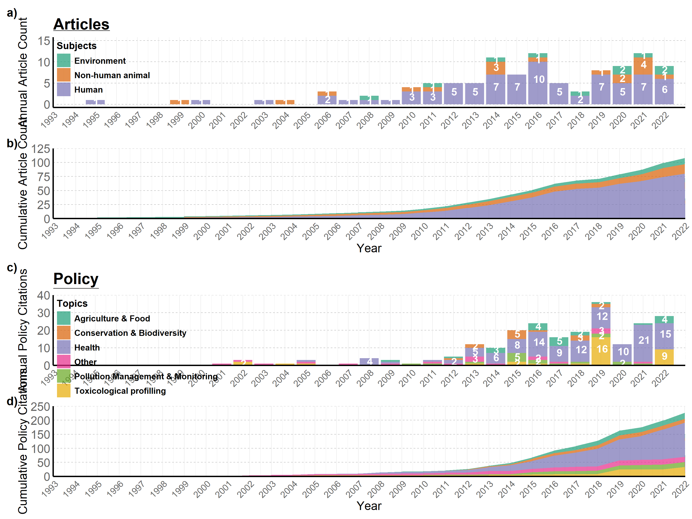

```r
# Save the final figure
ggsave(
  here("figures", "fig1.pdf"), 
  width = 16, height = 24, units = "cm", 
  scale = 2, dpi = 800
)

# Combine plots, ensuring the legend only appears in fig1a
fig1 <- fig1a / fig1b / fig1c / fig1d

# Display the final combined plot
fig1
```


```r
# Save the final figure
# ggsave(here("figures", "fig1.pdf"), width = 16, height = 24, units = "cm", scale = 2, dpi = 800)
# ggsave(here("figures", "fig1.svg"), width = 16, height = 24, units = "cm", scale = 2, dpi = 800)
```

## Policy country bar plot
Bar chart showing the annual number of policy citations on the included meta-analysis analyses synthesising research on the impacts of organochlorine pesticides, categorised by country

```r
policy_country <- ggplot(
  pol %>%
    # 1) Remove rows with NA policy_title
    filter(!is.na(policy_title)) %>%
    # 2) Split multi-country strings on semicolon and unnest
    mutate(policy_country = strsplit(policy_country, ";\\s+")) %>%
    unnest(policy_country) %>%
    # 3) Lump any country used fewer than 7 times overall
    group_by(policy_country) %>%
    mutate(total_count = n()) %>%
    ungroup() %>%
    mutate(policy_country = if_else(total_count < 5, "Other", policy_country)) %>%
    # 4) Keep only years <= 2023
    filter(policy_year <= 2023) %>%
    # 5) Count number of policies per (year, country)
    count(policy_year, policy_country) %>%
    # 6) Complete missing (year, country) combos from 1993 to 2022 with n = 0
    complete(
      policy_year = 1993:2022,
      policy_country = unique(policy_country),
      fill = list(n = 0)
    ),
  aes(x = policy_year, y = n, fill = policy_country)
) +
  geom_bar(stat = "identity", position = "stack", alpha = 0.7) +
  geom_text(
    aes(label = ifelse(n > 0, n, "")),
    position = position_stack(vjust = 0.6),
    fontface = "bold", color = "white", size = 6, hjust = 0.4
  ) +
  scale_x_continuous(
    breaks = 1993:2022,              
    limits = c(1993, 2023),          
    expand = expansion(0, 0)
  ) +
  scale_y_continuous(
    "Annual Policy Citations", 
    limits = c(0, 40),      # Adjust if you want a different max on the y-axis
    expand = expansion(0, 0)
  ) +
  labs(
    x = "Year",
    y = "Annual Policy Citations", 
    fill = "Policy Countries"
  ) +
  theme_count() +
  scale_fill_brewer(palette = "Dark2") +
  theme(
    axis.title.x = element_blank(),
    legend.position = c(0.0, 1),   # Top-left
    legend.justification = c(0, 1),
    legend.box.just = "left"
  ) +
  guides(
    fill = guide_legend(
      title = "Policy Countries",
      override.aes = list(alpha = 0.7, size = 8)
    )
  )

df_distinct_count <- pol %>%
  distinct(policy_title, policy_year) %>%
  nrow()

df_distinct_count
```

```
## [1] 173
```

```r
# ggsave(here("figures", "policy_country.pdf"), width = 16, height = 10, units = "cm", scale = 2, dpi = 800)
# ggsave(here("figures", "policy_country.svg"), width = 16, height = 10, units = "cm", scale = 2, dpi = 800)
```

## 
Create a standard theme for the supplementary plots

```r
organochlorTHEME <- function() {
  theme_minimal() +
  theme(
    title = element_text(size = 30),
    axis.text.y = element_text(size = 30),
    axis.text.x = element_text(size = 20),
    axis.line.x = element_line(color = "gray", size = 3),
    axis.line.y = element_blank(),
    axis.ticks.x = element_blank(),
    axis.ticks.y = element_blank(),
    axis.title.x = element_blank(),
    axis.title.y = element_blank(),
    panel.grid.major.y = element_blank(),
    panel.grid.minor.y = element_blank(),
    plot.tag = element_text(face = "bold"),
    legend.position = "none")    
}
```

## Alternative time trends
A) Bar chart showing the annual number of published meta-analyses synthesising research on the impacts of organochlorine pesticides.  
B) Line graph showing the cumulative time trends of meta-analyses synthesising research on the impacts of organochlorine pesticides.

```r
# Create the annual Count Plot
annual_article_count <- sd1 %>%
  ggplot(aes(x = publication_year, y = n)) +
    geom_col(fill = "#1b9e77", alpha = 0.7) +
    geom_text(aes(label = n), position = position_stack(vjust = 0.6), 
              fontface = "bold", color = "white", size = 6, hjust = 0.4) +
    scale_x_continuous(breaks = seq(min(sd1$publication_year), max(sd1$publication_year), by = 1), 
                       expand = expansion(0,1)) +
    scale_y_continuous("Annual Article Count", limits = c(0,15)) +
    labs(x = "Year", tag = "a)") +
    theme_count() +
    theme(axis.title.x = element_blank())


# Create the cumulative Count Plot
cum_article_count <- sd1 %>%
  ggplot(aes(x = publication_year, y = n_cumulative)) +
    geom_line(color = "#7570b3", size = 1, linetype = "solid") +
    geom_point(shape = 21, size = 6, fill = "#7570b3", stroke = 0) +
    geom_text(aes(label = n_cumulative), hjust = 0.2, vjust = -1, size = 6, color = "black") +
    scale_x_continuous(breaks = seq(min(sd1$publication_year), max(sd1$publication_year), by = 1), 
                       expand = expansion(0,1)) +
    scale_y_continuous("Cumulative Article Count", limits = c(0,120)) +
    labs(x = "Year", tag = "b)") +
    theme_count()

# Combine the two plots
alt_article_count <- annual_article_count / cum_article_count

alt_article_count
```

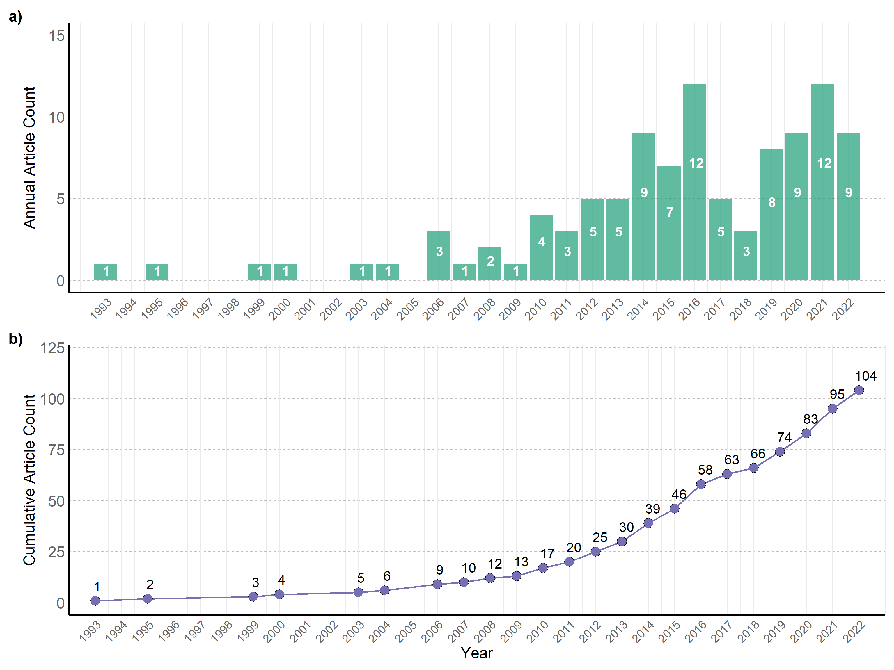

```r
# ggsave(here("figures", "alt_article_count.pdf"), width = 16, height = 12, units = "cm", scale = 2, dpi = 800)
# ggsave(here("figures", "alt_article_count.svg"), width = 16, height = 12, units = "cm", scale = 2, dpi = 800)
```

# Section 1
To evaluate the methodological quality and patterns of existing meta-analyses studying the effects of organochlorine pesticides. 

## Figure 2
The methodological and reporting quality of meta-analyses according to CEESAT v. 2.1 (Woodcock et al., 2014). Scores are represented by the following colours: gold is regarded as the highest (best) score, green is second highest score, amber is second-lowest score, and red is the lowest (worst) score. The total counts of studies allocated to each score are shown in each bar. All CEESAT v. 2.1 items, along with our interpretation, are provided in Supplementary File 2. 

## Figure 2a
CEESAT scores for 83 assessed meta-analyses 

```r
# Start the data manipulation
percent_ceesat_score <- sd %>%
  filter(!is.na(author_year)) %>%
  select(studies = author_year, starts_with("CEE")) %>%
  na.omit() %>%
  pivot_longer(cols = -studies, names_to = "question", values_to = "score") %>%
  group_by(question, score) %>%
  summarise(n = n(), .groups = 'drop') %>%
  mutate(percent = (n/sum(n))*100, 
         across(c(question, score), as.factor),
         question = fct_recode(question, 
           `1.1 Are the elements of the review question clear?` = "CEESAT2_1.1",
           `2.1 Is there an a-priori method protocol document?` = "CEESAT2_2.1",
           `3.1. Is the approach to searching clearly defined systematic and\ntransparent?` = "CEESAT2_3.1",
           `3.2. Is the search comprehensive?` = "CEESAT2_3.2",
           `4.1. Are eligibility criteria clearly defined?` = "CEESAT2_4.1",
           `4.2. Are eligibility criteria consistently applied to all potentially relevant\narticles and studies found during the search?` = "CEESAT2_4.2",
           `4.3. Are eligibility decisions transparently reported?` = "CEESAT2_4.3",
           `5.1. Does the review critically appraise each study?` = "CEESAT2_5.1",
           `5.2. During critical appraisal was an effort made to minimise\nsubjectivity?` = "CEESAT2_5.2",
           `6.1. Is the method of data extraction fully documented?` = "CEESAT2_6.1",
           `6.2. Are the extracted data reported for each study?` = "CEESAT2_6.2",
           `6.3. Were extracted data cross checked by more than one reviewer?` = "CEESAT2_6.3",
           `7.1. Is the choice of synthesis approach appropriate?` = "CEESAT2_7.1",
           `7.2. Is a statistical estimate of pooled effect provided together with\nmeasure of variance and heterogeneity among studies?` = "CEESAT2_7.2",
           `7.3 Is variability in the study findings investigated and discussed?` = "CEESAT2_7.3",
           `8.1 Have the authors considered limitations in the synthesis?` = "CEESAT2_8.1"),
         question = factor(question, levels = rev(levels(question))),
         score = factor(score, levels = levels(score)[c(4,1,3,2)]))

# Create CEESAT plot 
fig2a <- ggplot(data = percent_ceesat_score, aes(x = question, y = percent, fill = score)) +
  geom_col(width = 0.7, position = "fill", color = "black") +
  geom_text(aes(label = n), position = position_fill(vjust = 0.5), size = 7, fontface = "bold") +
  coord_flip() +
  guides(fill = guide_legend(reverse = TRUE)) +
  scale_fill_manual(values = c("#FF0000","#FFD700","#008000", "#DAA520"), name = "Score:") +
  scale_y_continuous(labels = scales::percent) +
  theme(panel.grid.major = element_blank(), 
        panel.grid.minor = element_blank(), 
        panel.background = element_blank(),
        axis.text.y = element_text(size = 20),
        axis.text.x = element_text(size = 20),
        axis.title.x = element_text(size = 25),
        axis.title.y = element_text(size = 25), 
        legend.position = "top",  
        legend.justification = "left",  
        legend.direction = "horizontal",
        legend.box = "horizontal",  
        legend.box.just = "left",  
        legend.title.align = 0.5,  
        legend.key.size = unit(1, "cm"),  
        legend.title = element_text(size =25),
        legend.text = element_text(size = 25),  
        strip.text = element_text(size = 20),
        strip.background = element_blank(), 
        plot.tag = element_text(size = 25)) + 
  ylab("Percentage") + 
  xlab("CEESAT Question") +  
  labs(tag = "a)")

fig2a
```

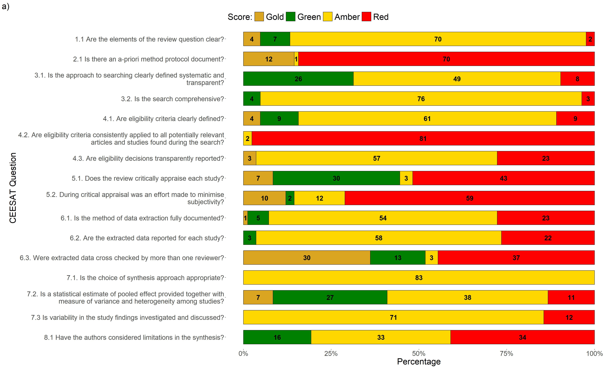

```r
total_n <- sum(percent_ceesat_score$n)
percentages <- tibble(
  red_percentage = sum(percent_ceesat_score$n[percent_ceesat_score$score == "Red"]) / total_n * 100,
  amber_percentage = sum(percent_ceesat_score$n[percent_ceesat_score$score == "Amber"]) / total_n * 100,
  green_percentage = sum(percent_ceesat_score$n[percent_ceesat_score$score == "Green"]) / total_n * 100,
  gold_percentage = sum(percent_ceesat_score$n[percent_ceesat_score$score == "Gold"]) / total_n * 100
)

 percentages
```

```
## # A tibble: 1 × 4
##   red_percentage amber_percentage green_percentage gold_percentage
##            <dbl>            <dbl>            <dbl>           <dbl>
## 1           32.9             50.5             10.7            5.87
```

```r
# ggsave(here("figures", "fig2a.pdf"), width = 25, height = 15, units = "cm", scale = 2, dpi = 800)
# ggsave(here("figures", "fig2a.svg"), width = 25, height = 15, units = "cm", scale = 2, dpi = 800)
```

## 
Making the CEESAT question groups for result reporting

```r
# Create new categories for specified questions in numerical order
percent_ceesat_score$combined_category <- ifelse(
  grepl("^1\\.1", percent_ceesat_score$question) | grepl("^2\\.1", percent_ceesat_score$question),
  "Study Question",
  ifelse(grepl("^3\\.1", percent_ceesat_score$question) | grepl("^3\\.2", percent_ceesat_score$question),
    "Literature Searching",
    ifelse(grepl("^4\\.1", percent_ceesat_score$question) | grepl("^4\\.2", percent_ceesat_score$question) | grepl("^4\\.3", percent_ceesat_score$question),
      "Literature Screening",
      ifelse(grepl("^5\\.1", percent_ceesat_score$question) | grepl("^5\\.2", percent_ceesat_score$question) | 
             grepl("^6\\.1", percent_ceesat_score$question) | grepl("^6\\.2", percent_ceesat_score$question) | grepl("^6\\.3", percent_ceesat_score$question),
        "Data Extraction", 
        ifelse(grepl("^7", percent_ceesat_score$question), "Data Analysis", 
          ifelse(grepl("^8", percent_ceesat_score$question), "Study Limitations", "Other"))))))

# Group by combined_category and score, then summarize
percent_ceesat_score_grouped <- percent_ceesat_score %>%
  group_by(combined_category, score) %>%
  summarise(total_n = sum(n))

# Calculate the total count for each special category
total_counts <- percent_ceesat_score_grouped %>%
  group_by(combined_category) %>%
  summarise(total_count = sum(total_n))

# Join total counts with grouped data
percent_ceesat_score_grouped <- left_join(percent_ceesat_score_grouped, total_counts, by = "combined_category")

# Add a column for relative percent
percent_ceesat_score_grouped <- percent_ceesat_score_grouped %>%
  mutate(relative_percent = (total_n / total_count) * 100)

print(percent_ceesat_score_grouped)
```

```
## # A tibble: 22 × 5
## # Groups:   combined_category [6]
##    combined_category    score total_n total_count relative_percent
##    <chr>                <fct>   <int>       <int>            <dbl>
##  1 Data Analysis        Red        23         249             9.24
##  2 Data Analysis        Amber     192         249            77.1 
##  3 Data Analysis        Green      27         249            10.8 
##  4 Data Analysis        Gold        7         249             2.81
##  5 Data Extraction      Red       184         415            44.3 
##  6 Data Extraction      Amber     130         415            31.3 
##  7 Data Extraction      Green      53         415            12.8 
##  8 Data Extraction      Gold       48         415            11.6 
##  9 Literature Screening Red       113         249            45.4 
## 10 Literature Screening Amber     120         249            48.2 
## # ℹ 12 more rows
```

```r
# view(percent_ceesat_score_grouped)
```

## 
Calculating altmetric for each study 

```r
# load data
bib_alt <- read_csv(here("data","scopus.csv")) 

# function getAltmetrics(), the only parameter is doi; see example below
getAltmetrics <- function(doi = NULL,
                          foptions = list(),
                           ...) {
    if (!is.null(doi)) doi <- stringr::str_c("doi/", doi)
    identifiers <- purrr::compact(list(doi))
    if (!is.null(identifiers)) {
      ids <- identifiers[[1]]
    }
    base_url <- "http://api.altmetric.com/v1/"
    #request <- httr::GET(paste0(base_url, ids), httr::add_headers("user-agent" = "#rstats rAltmertic package https://github.com/ropensci/rAltmetric"))
    request <- httr::GET(paste0(base_url, ids))
    results <-
      jsonlite::fromJSON(httr::content(request, as = "text"), flatten = TRUE)
    results <- rlist::list.flatten(results)
    class(results) <- "altmetric"
    results
}
altmetric.crawler <- list(NULL)
for (n in 1:length(bib_alt$DOI)) {
 # format altmetric object
  format.Altmetric <- function(altmetric.object) {
  stats <- altmetric.object[grep("^cited", names(altmetric.object))]
  stats <- data.frame(stats, stringsAsFactors = FALSE)
  data.frame(paper_title = altmetric.object$title,
             journal = altmetric.object$journal,
             doi = altmetric.object$doi,
             #subject = altmetric.object$subjects,
             Altmetric.score = altmetric.object$score,
             stats = stats)
}
   # JASON formate
  altmetric.crawler[[n]]  <-  try(list(format.Altmetric(getAltmetrics(doi = bib_alt$DOI[n])))) # https://stackoverflow.com/questions/14059657/how-to-skip-an-error-in-a-loop?rq=1
  
  # create a dataframe function
  altmetric_df <- function(altmetric.object) {
  df <- data.frame(t(unlist(altmetric.object)), stringsAsFactors = FALSE)
  }
  #altmetric.crawler[[n]]  <-  try(list(altmetric_df(getAltmetrics(doi = DOIs[n]))))
  # create a function to summarize Altmetric object
  summary.altmetric <- function(x, ...) {
  if (inherits(x, "altmetric"))  {
string <- "Altmetrics on: \"%s\" with altmetric_id: %s published in %s."
vals   <- c(x$title,  x$altmetric_id, x$journal)
 if("journal" %in% names(x)) {
  cat(do.call(sprintf, as.list(c(string, vals))))
 } else {
   string <- "Altmetrics on: \"%s\" with altmetric_id: %s"
   cat(do.call(sprintf, as.list(c(string, vals))))
 }
  cat("\n")
  stats <- x[grep("^cited", names(x))]
  stats <- data.frame(stats, stringsAsFactors = FALSE)
  print(data.frame(stats = t(stats)))
  }
}
  # crawl
 # altmetric.crawler[[n]] <- try(list(summary.altmetric(getAltmetrics(doi = DOIs[n]))))
}
```

```
## Error : lexical error: invalid char in json text.
##                                        Not Found
##                      (right here) ------^
## 
## Error : lexical error: invalid char in json text.
##                                        Not Found
##                      (right here) ------^
## 
## Error : lexical error: invalid char in json text.
##                                        Not Found
##                      (right here) ------^
## 
## Error : lexical error: invalid char in json text.
##                                        Not Found
##                      (right here) ------^
## 
## Error : lexical error: invalid char in json text.
##                                        Not Found
##                      (right here) ------^
## 
## Error : lexical error: invalid char in json text.
##                                        Not Found
##                      (right here) ------^
## 
## Error : lexical error: invalid char in json text.
##                                        Not Found
##                      (right here) ------^
## 
## Error : lexical error: invalid char in json text.
##                                        Not Found
##                      (right here) ------^
## 
## Error : lexical error: invalid char in json text.
##                                        Not Found
##                      (right here) ------^
## 
## Error : lexical error: invalid char in json text.
##                                        Not Found
##                      (right here) ------^
## 
## Error : lexical error: invalid char in json text.
##                                        Not Found
##                      (right here) ------^
## 
## Error : lexical error: invalid char in json text.
##                                        Not Found
##                      (right here) ------^
## 
## Error : lexical error: invalid char in json text.
##                                        Not Found
##                      (right here) ------^
## 
## Error : lexical error: invalid char in json text.
##                                        Not Found
##                      (right here) ------^
```

```r
# save results from altmetric.crawler and retrieve lists within lists
altmetric.crawler2 <- sapply(altmetric.crawler, function(x) {x})
# retrieve stats
altmetric.summary <- data.frame(paper_title = sapply(altmetric.crawler2, function(x)  ifelse(class(x) == "data.frame",x$paper_title,NA)),
           journal = sapply(altmetric.crawler2, function(x) ifelse(class(x) == "data.frame",x$journal,NA)),
           doi = sapply(altmetric.crawler2, function(x) ifelse(class(x) == "data.frame",x$doi,NA)),
           #subject = sapply(altmetric.crawler2, function(x) ifelse(class(x) == "data.frame",x$subject,NA)),
           Altmetric.score = sapply(altmetric.crawler2, function(x) ifelse(class(x) == "data.frame",x$Altmetric.score,0)),
           policy = sapply(altmetric.crawler2, function(x) ifelse(class(x) == "data.frame",ifelse(!is.null(x$stats.cited_by_policies_count),x$stats.cited_by_policies_count,0),0)),
           patent = sapply(altmetric.crawler2, function(x) ifelse(class(x) == "data.frame",ifelse(!is.null(x$stats.cited_by_patents_count),x$stats.cited_by_patents_count,0),0))
           )
# Adding new columns to bib_alt dataframe
bib_alt <- bib_alt %>%
   mutate(Altmetric.score = altmetric.summary$Altmetric.score, 
          policy = altmetric.summary$policy, 
          patent = altmetric.summary$patent)

# Defining the scoring function
score <- function(x) {
  case_when(
    x == 'Red' ~ 0,
    x == 'Amber' ~ 1,
    x == 'Green' ~ 3,
    x == 'Gold' ~ 4,
    TRUE ~ NA_real_
  )
}
# Apply the scoring function across all columns starting with "CEESAT"
sd <- sd %>%
  mutate(across(starts_with("CEESAT"), score, .names = "points_{.col}"))
# Sum all the points columns to create a 'total_points' column
sd <- sd %>%
  mutate(total_points = rowSums(select(., starts_with("points_")), na.rm = TRUE))
```

## Figure 2b
CEESAT scores for meta-analyses cited in policy documents (left panel) and those not cited in policy documents (right panel). 

```r
# Converting policy to binary and dropping NAs
sd_bib_alt_policy <- left_join(sd, pol, join_by("author_year"), multiple = "all")

sd_bib_alt_policy <- sd_bib_alt_policy %>%
  # Ensure only unique author_year entries are kept
  distinct(author_year, .keep_all = TRUE) %>%
  
  # Create a new column categorizing policy presence
  mutate(
    policy_status = case_when(
      is.na(policy_title) ~ "No Policy",   # If missing (NA), classify as "No Policy"
      policy_title == "no policy" ~ "No Policy",  # If explicitly "no policy", classify as "No Policy"
      TRUE ~ "Policy"   # Everything else is considered a policy document
    )
  )

percent_ceesat_score1 <- sd_bib_alt_policy %>%
  filter(!is.na(author_year)) %>%
  select(studies = author_year, policy_status, starts_with("CEE")) %>%
  na.omit() %>%
  pivot_longer(cols = -c(studies, policy_status), names_to = "question", values_to = "score") %>%
  group_by(policy_status, question, score) %>%
  summarise(n = n(), .groups = 'drop') %>%
  mutate(percent = (n/sum(n))*100, 
         across(c(question, score), as.factor),
         question = fct_recode(question, 
           `1.1` = "CEESAT2_1.1",
           `2.1` = "CEESAT2_2.1",
           `3.1` = "CEESAT2_3.1",
           `3.2` = "CEESAT2_3.2",
           `4.1` = "CEESAT2_4.1",
           `4.2` = "CEESAT2_4.2",
           `4.3` = "CEESAT2_4.3",
           `5.1` = "CEESAT2_5.1",
           `5.2` = "CEESAT2_5.2",
           `6.1` = "CEESAT2_6.1",
           `6.2` = "CEESAT2_6.2",
           `6.3` = "CEESAT2_6.3",
           `7.1` = "CEESAT2_7.1",
           `7.2` = "CEESAT2_7.2",
           `7.3` = "CEESAT2_7.3",
           `8.1` = "CEESAT2_8.1"),
         question = factor(question, levels = rev(levels(question))),
         score = factor(score, levels = levels(score)[c(4,1,3,2)]))


fig2b <- ggplot(data = percent_ceesat_score1, aes(x = question, y = percent, fill = score)) +
  geom_col(width = 0.7, position = "fill", color = "black") +
  geom_text(aes(label = n), position = position_fill(vjust = 0.5), size = 7, fontface = "bold") +
  coord_flip() +
  guides(fill = guide_legend(reverse = TRUE)) +
  scale_fill_manual(values = c("#FF0000","#FFD700","#008000", "#DAA520"), name = "Score:") +
  scale_y_continuous(labels = scales::percent) +
  theme(panel.grid.major = element_blank(), 
        panel.grid.minor = element_blank(), 
        panel.background = element_blank(),
        axis.text.y = element_text(size = 20),
        axis.text.x = element_text(size = 20),
        axis.title.x = element_text(size = 25),
        axis.title.y = element_text(size = 25), 
        legend.position = "none",
        strip.text = element_text(size = 20),
        strip.background = element_blank(), 
        plot.tag = element_text(size = 25)) + 
  ylab("Percentage") + 
  xlab("CEESAT Question") +
  facet_wrap(~policy_status) +
  labs(tag = "b)")

fig2b
```

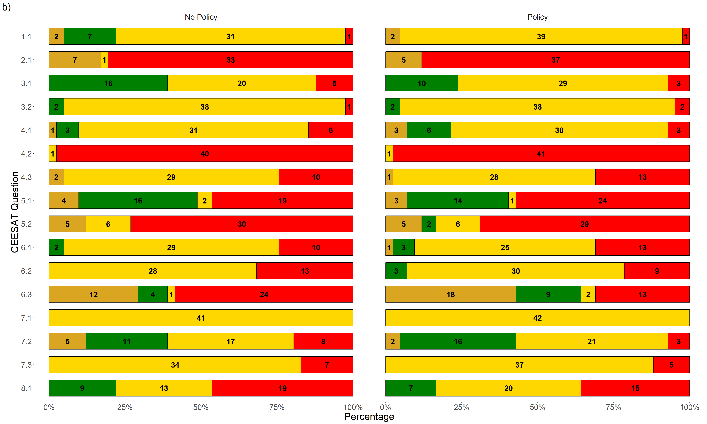

```r
# ggsave(here("figures", "fig2b.pdf"), width = 25, height = 15, units = "cm", scale = 2, dpi = 800)
# ggsave(here("figures", "fig2b.svg"), width = 25, height = 15, units = "cm", scale = 2, dpi = 800)


policy <- sd_bib_alt_policy$total_points[sd_bib_alt_policy$policy_status == "Policy"]
not_policy <- sd_bib_alt_policy$total_points[sd_bib_alt_policy$policy_status == "No Policy"]


# Create a tibble for policy values
policy_df <- tibble(
  values = policy,
  category = "Policy"
)

# Create a tibble for not_policy values
not_policy_df <- tibble(
  values = not_policy,
  category = "No Policy"
)

# Combine both tibbles into one
policy_combined <- bind_rows(policy_df, not_policy_df)

# View the combined tibble
print(policy_combined)
```

```
## # A tibble: 104 × 2
##    values category
##     <dbl> <chr>   
##  1     13 Policy  
##  2     21 Policy  
##  3     21 Policy  
##  4      0 Policy  
##  5     15 Policy  
##  6     17 Policy  
##  7      3 Policy  
##  8     16 Policy  
##  9     17 Policy  
## 10     14 Policy  
## # ℹ 94 more rows
```

```r
# QQ Plot
qqnorm(policy)
qqline(policy, col = "red")
```

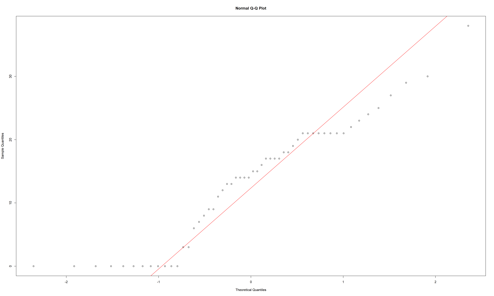

```r
# QQ Plot
qqnorm(not_policy)
qqline(not_policy, col = "red") 
```

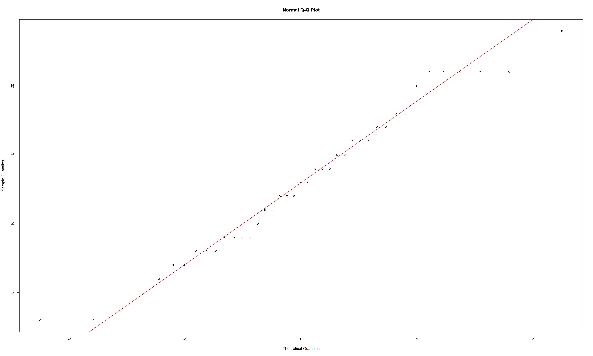

```r
policy_model <- clm(factor(values) ~ category, data=policy_combined)

summary(policy_model)
```

```
## formula: factor(values) ~ category
## data:    policy_combined
## 
##  link  threshold nobs logLik  AIC    niter max.grad cond.H 
##  logit flexible  104  -319.95 705.89 9(3)  1.88e-13 3.6e+03
## 
## Coefficients:
##                Estimate Std. Error z value Pr(>|z|)
## categoryPolicy  0.04169    0.34233   0.122    0.903
## 
## Threshold coefficients:
##       Estimate Std. Error z value
## 0|3   -1.35344    0.29825  -4.538
## 3|4   -1.18322    0.28830  -4.104
## 4|5   -1.12985    0.28550  -3.957
## 5|6   -1.07791    0.28302  -3.809
## 6|7   -1.02728    0.28072  -3.659
## 7|8   -0.88221    0.27484  -3.210
## 8|9   -0.70142    0.26939  -2.604
## 9|10  -0.53123    0.26588  -1.998
## 10|11 -0.44908    0.26478  -1.696
## 11|12 -0.32855    0.26402  -1.244
## 12|13 -0.21044    0.26409  -0.797
## 13|14 -0.13264    0.26434  -0.502
## 14|15  0.02161    0.26450   0.082
## 15|16  0.13709    0.26458   0.518
## 16|17  0.33177    0.26631   1.246
## 17|18  0.61558    0.27217   2.262
## 18|19  0.78808    0.27719   2.843
## 19|20  0.87844    0.28036   3.133
## 20|21  1.07018    0.28876   3.706
## 21|22  1.65535    0.32417   5.106
## 22|23  1.80323    0.33560   5.373
## 23|24  2.05957    0.35928   5.732
## 24|25  2.15742    0.36963   5.837
## 25|26  2.26341    0.38154   5.932
## 26|27  2.37935    0.39567   6.013
## 27|29  2.50760    0.41270   6.076
## 29|30  2.65143    0.43346   6.117
## 30|31  3.00805    0.49400   6.089
## 31|32  3.24108    0.54172   5.983
## 32|37  3.53860    0.61348   5.768
## 37|38  3.95391    0.73682   5.366
## 38|39  4.65680    1.02117   4.560
```

```r
policy_model_sensitivity <- t.test(policy,not_policy) 

policy_model_sensitivity
```

```
## 
## 	Welch Two Sample t-test
## 
## data:  policy and not_policy
## t = -0.13057, df = 100.22, p-value = 0.8964
## alternative hypothesis: true difference in means is not equal to 0
## 95 percent confidence interval:
##  -4.114662  3.606514
## sample estimates:
## mean of x mean of y 
##  13.42593  13.68000
```

## Figure 3a
Bar plot showing the percentage and total count of bias methodologies used in meta-analyses investigating the impacts of organochlorine pesticides. Note that some meta-analyses may contribute to multiple sections if the study involved the use of multiple bias assessment methodologies. 

```r
# Calculate the total count for each category
bias_method_count <- sd %>% 
  separate_rows(bias_assessment_method, sep = ",\\s+") %>% 
  count(bias_assessment_method) %>%
  filter(bias_assessment_method != "NA") %>%
  group_by(bias_assessment_method) %>%
  summarise(n = sum(n))

# Calculate proportion and percentage
bias_method_pct <- bias_method_count %>%
  mutate(proportion = n / 83,
         percentage = proportion * 100)

# Create the bar plot
fig3a <- bias_method_count %>%
  ggplot(aes(x = n, y = reorder(bias_assessment_method, n), 
             fill = ifelse(grepl("Not reported", bias_assessment_method), "#7370b3", "#1b9e77"))) +
  geom_bar(stat = "identity", width = 0.8, alpha = 0.7) +
  geom_text(aes(label = ifelse(n > 1, n, ""), x = n / 2), hjust = 0.5, size = 12, color = "black") +
  geom_text(data = bias_method_pct %>% filter(n > 1), 
            aes(label = paste0("(", round(percentage, 1), "%)"), x = n), 
            hjust = -0.1, size = 12, color = "black", fontface = "bold") +
  scale_fill_identity(guide = "none") +
  scale_x_continuous(expand = c(0, 0), limits = c(0, max(bias_method_count$n) * 1.3)) +
  labs(title = "Publication Bias Count", x = NULL, y = NULL, tag = "a)", size = 30) +
  organochlorTHEME()

fig3a
```

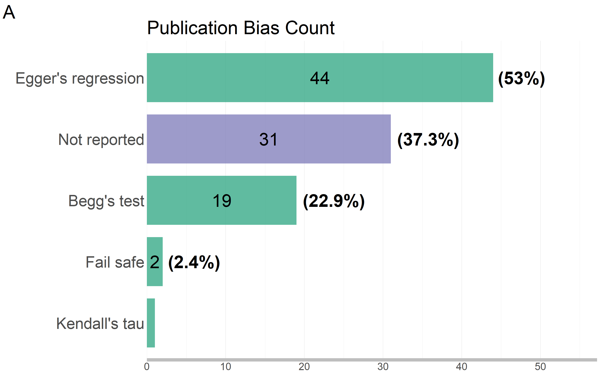

```r
# ggsave(here("figures", "fig3a.pdf"), width = 16, height = 10, units = "cm", scale = 2, dpi = 800)
# ggsave(here("figures", "fig3a.svg"), width = 16, height = 10, units = "cm", scale = 2, dpi = 800)
```

## Figure 3b
Bar plot showing the percentage and total count of heterogeneity assessment methods used in meta-analyses investigating the impacts of organochlorine pesticides. Note that some meta-analyses may contribute to multiple sections if the study involved multiple heterogeneity assessments. Percentage is showing the proportion of studies.

```r
# Figure 3b: Heterogeneity Assessment Methods
heterogeneity_count <- sd %>% 
  separate_rows(heterogeneity_assessment_method, sep = ",\\s+") %>% 
  count(heterogeneity_assessment_method) %>%
  filter(heterogeneity_assessment_method != "NA") %>%
  group_by(heterogeneity_assessment_method) %>%
  summarise(n = sum(n))

heterogeneity_pct <- heterogeneity_count %>%
  mutate(proportion = n / 83,
         percentage = proportion * 100)

fig3b <- heterogeneity_count %>%
  ggplot(aes(x = n, y = reorder(heterogeneity_assessment_method, n), 
             fill = ifelse(grepl("Not reported", heterogeneity_assessment_method), "#7370b3", "#1b9e77"))) +
  geom_bar(stat = "identity", width = 0.8, alpha = 0.7) +
  geom_text(aes(label = ifelse(n > 1, n, ""), x = n / 2), hjust = 0.5, size = 12, color = "black") +
  geom_text(data = heterogeneity_pct %>% filter(n > 1), 
            aes(label = paste0("(", round(percentage, 1), "%)"), x = n), 
            hjust = -0.1, size = 12, color = "black", fontface = "bold") +
  scale_fill_identity(guide = "none") +
  scale_x_continuous(expand = c(0, 0), limits = c(0, max(heterogeneity_count$n) * 1.3)) +
  labs(title = "Heterogeneity Count", x = NULL, y = NULL, tag = "b)", size = 30) +
  organochlorTHEME()

fig3b
```

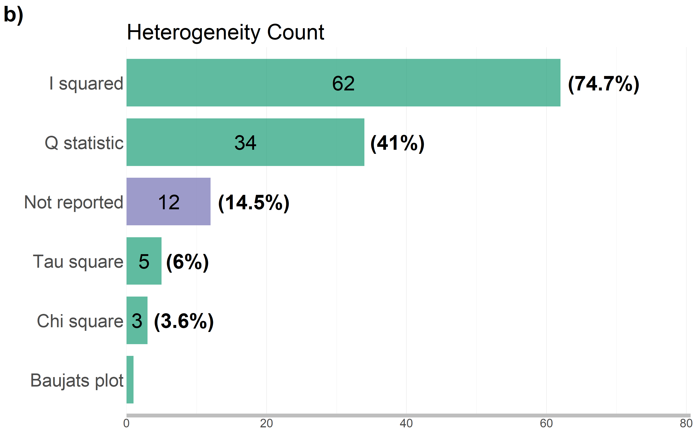

```r
# ggsave(here("figures", "fig3b.pdf"), width = 16, height = 10, units = "cm", scale = 2, dpi = 800)
# ggsave(here("figures", "fig3b.svg"), width = 16, height = 10, units = "cm", scale = 2, dpi = 800)
```
 
## Figure 3c
Bar plot showing the percentage and total count of sensitivity analyses conducted in meta-analyses investigating the impacts of organochlorine pesticides. Note that some meta-analyses may contribute to multiple sections if the study involved multiple sensitivity analyses.

```r
# Figure 3c: Sensitivity Analysis Methods
sensitivity_count <- sd %>% 
  separate_rows(sensitivity_analysis_method, sep = ",\\s+") %>% 
  count(sensitivity_analysis_method) %>%
  filter(sensitivity_analysis_method != "NA") %>%
  group_by(sensitivity_analysis_method) %>%
  summarise(n = sum(n))

sensitivity_pct <- sensitivity_count %>%
  mutate(proportion = n / 83,
         percentage = proportion * 100)

fig3c <- sensitivity_count %>%
  ggplot(aes(x = n, y = reorder(sensitivity_analysis_method, n), 
             fill = ifelse(grepl("Not reported", sensitivity_analysis_method), "#7370b3", "#1b9e77"))) +
  geom_bar(stat = "identity", width = 0.8, alpha = 0.7) +
  geom_text(aes(label = ifelse(n > 1, n, ""), x = n / 2), hjust = 0.5, size = 12, color = "black") +
  geom_text(data = sensitivity_pct %>% filter(n > 1), 
            aes(label = paste0("(", round(percentage, 1), "%)"), x = n), 
            hjust = -0.1, size = 12, color = "black", fontface = "bold") +
  scale_fill_identity(guide = "none") +
  scale_x_continuous(expand = c(0, 0), limits = c(0, max(sensitivity_count$n) * 1.3)) +
  labs(title = "Sensitivity Analysis Count", x = NULL, y = NULL, tag = "c)", size = 30) +
  organochlorTHEME()

fig3c
```

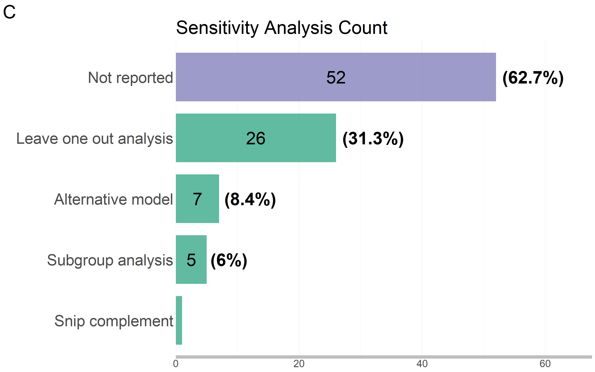

```r
# ggsave(here("figures", "fig3c.pdf"), width = 16, height = 10, units = "cm", scale = 2, dpi = 800)
# ggsave(here("figures", "fig3c.svg"), width = 16, height = 10, units = "cm", scale = 2, dpi = 800)
```

## Figure 3d
Bar plot showing the percentage and total count of reporting guidelines used in meta-analyses investigating the impacts of organochlorine pesticides. Note that some meta-analyses may contribute to multiple sections if the study involved the use of multiple reporting guidelines.

```r
# Figure 3d: Reporting Guidelines
reporting_guide_count <- sd %>% 
  separate_rows(reporting_standards_type, sep = ",\\s+") %>% 
  count(reporting_standards_type) %>%
  filter(reporting_standards_type != "NA") %>%
  mutate(reporting_standards_type = ifelse(n < 3, "Other Guidelines", as.character(reporting_standards_type))) %>%
  group_by(reporting_standards_type) %>%
  summarise(n = sum(n))

reporting_guide_pct <- reporting_guide_count %>%
  mutate(proportion = n / 83,
         percentage = proportion * 100)

fig3d <- reporting_guide_count %>%
  ggplot(aes(x = n, y = reorder(reporting_standards_type, n), 
             fill = ifelse(grepl("Not reported", reporting_standards_type), "#7370b3", "#1b9e77"))) +
  geom_bar(stat = "identity", width = 0.8, alpha = 0.7) +
  geom_text(aes(label = ifelse(n > 1, n, ""), x = n / 2), hjust = 0.5, size = 12, color = "black") +
  geom_text(data = reporting_guide_pct %>% filter(n > 1), 
            aes(label = paste0("(", round(percentage, 0), "%)"), x = n), 
            hjust = -0.1, size = 12, color = "black", fontface = "bold") +
  scale_fill_identity(guide = "none") +
  scale_x_continuous(expand = c(0, 0), limits = c(0, max(reporting_guide_count$n) * 1.3)) +
  labs(title = "Reporting Guideline Count", x = "Count", y = NULL, tag = "d)", size = 30) +
  organochlorTHEME()

fig3d
```

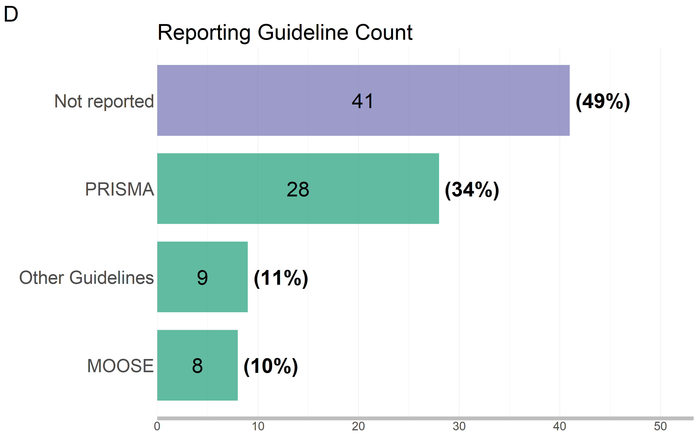

```r
# ggsave(here("figures", "fig3d.pdf"), width = 16, height = 10, units = "cm", scale = 2, dpi = 800)
# ggsave(here("figures", "fig3d.svg"), width = 16, height = 10, units = "cm", scale = 2, dpi = 800)
```

## CEESAT reporting guideline
CEESAT scores for meta-analyses referencing a reporting guideline (right panel) and those not referencing a reporting guideline (left panel).

```r
sd_bib_alt_guideline <- sd %>% 
  mutate(binary_guideline = if_else(reporting_standards_type == "Not reported", "Not reported", "Reported")) %>% 
    drop_na(binary_guideline, total_points)

percent_ceesat_score2 <- sd_bib_alt_guideline %>%
  filter(!is.na(author_year)) %>%
  select(studies = author_year, binary_guideline, starts_with("CEE")) %>%
  na.omit() %>%
  pivot_longer(cols = -c(studies, binary_guideline), names_to = "question", values_to = "score") %>%
  group_by(binary_guideline, question, score) %>%
  summarise(n = n(), .groups = 'drop') %>%
  mutate(percent = (n/sum(n))*100, 
         across(c(question, score), as.factor),
         question = fct_recode(question, 
           `1.1` = "CEESAT2_1.1",
           `2.1` = "CEESAT2_2.1",
           `3.1` = "CEESAT2_3.1",
           `3.2` = "CEESAT2_3.2",
           `4.1` = "CEESAT2_4.1",
           `4.2` = "CEESAT2_4.2",
           `4.3` = "CEESAT2_4.3",
           `5.1` = "CEESAT2_5.1",
           `5.2` = "CEESAT2_5.2",
           `6.1` = "CEESAT2_6.1",
           `6.2` = "CEESAT2_6.2",
           `6.3` = "CEESAT2_6.3",
           `7.1` = "CEESAT2_7.1",
           `7.2` = "CEESAT2_7.2",
           `7.3` = "CEESAT2_7.3",
           `8.1` = "CEESAT2_8.1"),
         question = factor(question, levels = rev(levels(question))),
         score = factor(score, levels = levels(score)[c(4,1,3,2)]))

ceesat_report <- ggplot(data = percent_ceesat_score2, aes(x = question, y = percent, fill = score)) +
  geom_col(width = 0.7, position = "fill", color = "black") +
  geom_text(aes(label = n), position = position_fill(vjust = 0.5), size = 7, fontface = "bold") +
  coord_flip() +
  guides(fill = guide_legend(reverse = TRUE)) +
  scale_fill_manual(values = c("#FF0000","#FFD700","#008000", "#DAA520"), name = "Score:") +
  scale_y_continuous(labels = scales::percent) +
  theme(panel.grid.major = element_blank(), 
        panel.grid.minor = element_blank(), 
        panel.background = element_blank(),
        axis.text.y = element_text(size = 20),
        axis.text.x = element_text(size = 20),
        axis.title.x = element_text(size = 25),
        axis.title.y = element_text(size = 25), 
        legend.position = "top",  
        legend.justification = "left",  
        legend.direction = "horizontal",
        legend.box = "horizontal",  
        legend.box.just = "left",  
        legend.title.align = 0.5,  
        legend.key.size = unit(1, "cm"),  
        legend.title = element_text(size =25),
        legend.text = element_text(size = 25),  
        strip.text = element_text(size = 20),
        strip.background = element_blank()) +  
  ylab("Percentage") + 
  xlab("CEESAT Question") +
  facet_wrap(~binary_guideline) 

ceesat_report
```

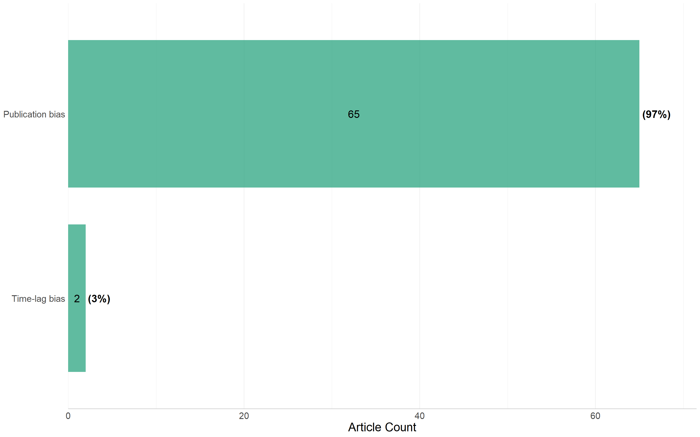

```r
# ggsave(here("figures", "ceesat_report.pdf"), width = 25, height = 15, units = "cm", scale = 2, dpi = 800)
# ggsave(here("figures", "ceesat_report.svg"), width = 25, height = 15, units = "cm", scale = 2, dpi = 800)

guideline <- sd_bib_alt_guideline$total_points[sd_bib_alt_guideline$binary_guideline == "Reported"]
no_guideline <- sd_bib_alt_guideline$total_points[sd_bib_alt_guideline$binary_guideline == "Not reported"]


# Create a tibble for policy values
guideline_df <- tibble(
  values = guideline,
  category = "Cited Guideline"
)

# Create a tibble for not_policy values
no_guideline_df <- tibble(
  values = no_guideline,
  category = "No Guideline"
)

# Combine both tibbles into one
guideline_combined <- bind_rows(guideline_df, no_guideline_df)

# View the combined tibble
print(guideline_combined)
```

```
## # A tibble: 79 × 2
##    values category       
##     <dbl> <chr>          
##  1      7 Cited Guideline
##  2     11 Cited Guideline
##  3     17 Cited Guideline
##  4     21 Cited Guideline
##  5     20 Cited Guideline
##  6     16 Cited Guideline
##  7     31 Cited Guideline
##  8     15 Cited Guideline
##  9     37 Cited Guideline
## 10     16 Cited Guideline
## # ℹ 69 more rows
```

```r
guideline_model <- clm(factor(values) ~ category, data=guideline_combined)

summary(guideline_model)
```

```
## formula: factor(values) ~ category
## data:    guideline_combined
## 
##  link  threshold nobs logLik  AIC    niter max.grad cond.H 
##  logit flexible  79   -239.91 543.82 7(0)  1.32e-10 1.1e+03
## 
## Coefficients:
##                      Estimate Std. Error z value Pr(>|z|)    
## categoryNo Guideline  -2.4120     0.4656   -5.18 2.22e-07 ***
## ---
## Signif. codes:  0 '***' 0.001 '**' 0.01 '*' 0.05 '.' 0.1 ' ' 1
## 
## Threshold coefficients:
##       Estimate Std. Error z value
## 3|4    -5.4661     0.8159  -6.699
## 4|5    -5.0368     0.7056  -7.138
## 5|6    -4.7247     0.6429  -7.348
## 6|7    -4.4765     0.6018  -7.439
## 7|8    -3.9375     0.5328  -7.391
## 8|9    -3.5474     0.4963  -7.148
## 9|10   -3.1240     0.4646  -6.724
## 10|11  -2.9399     0.4524  -6.498
## 11|12  -2.6925     0.4375  -6.154
## 12|13  -2.4601     0.4241  -5.801
## 13|14  -2.3063     0.4149  -5.559
## 14|15  -2.0034     0.3959  -5.060
## 15|16  -1.7814     0.3818  -4.666
## 16|17  -1.4169     0.3588  -3.949
## 17|18  -0.9985     0.3371  -2.963
## 18|19  -0.7251     0.3270  -2.218
## 19|20  -0.5890     0.3235  -1.820
## 20|21  -0.3875     0.3212  -1.206
## 21|22   0.4028     0.3269   1.232
## 22|23   0.5959     0.3335   1.787
## 23|24   0.9087     0.3520   2.582
## 24|25   1.0256     0.3608   2.842
## 25|26   1.1529     0.3712   3.106
## 26|27   1.2894     0.3842   3.356
## 27|29   1.4373     0.4003   3.591
## 29|30   1.6001     0.4206   3.804
## 30|31   1.9927     0.4816   4.138
## 31|32   2.2427     0.5301   4.231
## 32|37   2.5566     0.6028   4.241
## 37|38   2.9876     0.7275   4.107
## 38|39   3.7056     1.0141   3.654
```

```r
t.test(guideline,no_guideline)
```

```
## 
## 	Welch Two Sample t-test
## 
## data:  guideline and no_guideline
## t = 6.1128, df = 68.538, p-value = 5.269e-08
## alternative hypothesis: true difference in means is not equal to 0
## 95 percent confidence interval:
##   6.091412 11.994595
## sample estimates:
## mean of x mean of y 
##  21.92105  12.87805
```

## Box ceesat scores
Box and violin plot showing the distribution of CEESAT scores for studies cited in policy documents and studies not cited in policy documents

```r
box_ceesat <- policy_combined %>%
  ggplot(aes(x = category, y = values)) +
  geom_violin(fill = "#1b9e77", alpha =0.2, color = NA, trim = FALSE) +
  geom_boxplot(width = 0.05, fill = "white", color = "#1b9e77", outlier.shape = NA) +
  geom_jitter(width = 0.1, height = 0.05, color = "#1b9e77", alpha = 0.8, size = 6) +
  scale_y_continuous(limits = c(0, max(sd$total_points))) +
  labs( x = "Policy", y = "Total CEESAT Score") +
  theme_minimal() +
  theme(panel.grid.major.y = element_blank(),
        axis.line.y = element_blank(),
        axis.ticks.y = element_blank(),
        axis.text.x = element_text(size = 25),
        axis.text.y = element_text(size = 25),
        axis.title.x = element_text(size = 30),
        axis.title.y = element_text(size = 30),
        plot.title = element_blank())

box_ceesat
```

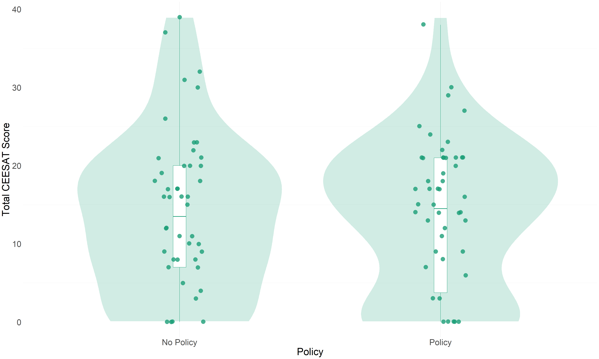

```r
# ggsave(here("figures", "box_ceesat.pdf"), width = 25, height = 15, units = "cm", scale = 2, dpi = 800)
# ggsave(here("figures", "box_ceesat.svg"), width = 25, height = 15, units = "cm", scale = 2, dpi = 800)
```


## Alluvial plot for bias assessment
Alluvial plot showing the relationship between the Journal Citation Report Category and bias assessment method.

```r
# Data Transformation 
bias_assessment_alluvial <- sd %>% 
    separate_rows(bias_assessment_method, sep = ",\\s+") %>%
    separate_rows(Journal_Category_Allocated_Broad, sep = "/\\s+") %>% 
    filter(!is.na(bias_assessment_method)) %>%
    group_by(Journal_Category_Allocated_Broad, bias_assessment_method) %>% 
    count(bias_assessment_method, Journal_Category_Allocated_Broad) %>% 
    summarise(freq = n(), .groups = 'drop') %>% 
    group_by(bias_assessment_method)

# Create the Alluvial plot
alluvial_bias <- bias_assessment_alluvial %>% 
  ggplot(aes(y = freq ,axis1 = Journal_Category_Allocated_Broad, axis2 = bias_assessment_method)) +
  scale_x_discrete(limits = c("Journal Citation Category", "Bias Assessment"), expand = c(.05, .05)) +
  xlab("Variables") +
  geom_alluvium(aes(fill = Journal_Category_Allocated_Broad)) +
  geom_stratum(width = 1/3.5, fill = "white", color = "black") +
  geom_text(stat = "stratum", aes(label = after_stat(stratum)), size = 6) +
  labs(x= "Variables", y = "Frequency", fill = "Journal Category Allocated") +
  scale_fill_brewer(palette = "Dark2") +
  organochlorTHEME() 

alluvial_bias
```


```r
# ggsave(here("figures", "alluvial_bias.pdf"), width = 16, height = 10, units = "cm", scale = 2, dpi = 800)
# ggsave(here("figures", "alluvial_bias.jpg"), width = 16, height = 10, units = "cm", scale = 2, dpi = 800)
```

## Alluvial plot for Heterogeneity
Alluvial plot showing the relationship between the Journal Citation Report Category and heterogeneity assessment method.

```r
# Data Transformation 
heterogeneity_alluvial <- sd %>% 
    separate_rows(heterogeneity_assessment_method, sep = ",\\s+") %>%
    separate_rows(Journal_Category_Allocated_Broad, sep = "/\\s+") %>% 
    filter(!is.na(heterogeneity_assessment_method)) %>%
    group_by(Journal_Category_Allocated_Broad, heterogeneity_assessment_method) %>% 
    count(heterogeneity_assessment_method, Journal_Category_Allocated_Broad) %>% 
    summarise(freq = n(), .groups = 'drop') %>% 
    group_by(heterogeneity_assessment_method) 

# Create the Alluvial plot
alluvial_het <- heterogeneity_alluvial %>% 
ggplot(aes(y = freq ,axis1 = Journal_Category_Allocated_Broad, axis2 = heterogeneity_assessment_method)) +
  scale_x_discrete(limits = c("Journal Citation Category", "Heterogeneity"), expand = c(.05, .05)) +
  xlab("Variables") +
  geom_alluvium(aes(fill = Journal_Category_Allocated_Broad)) +
  geom_stratum(width = 1/4.5, fill = "white", color = "black") +
  geom_text(stat = "stratum", aes(label = after_stat(stratum)), size = 6) +
  labs(x= "Variables", y = "Frequency", fill = "Journal Category Allocated") +
  scale_fill_brewer(palette = "Dark2") +
  organochlorTHEME() 

alluvial_het
```

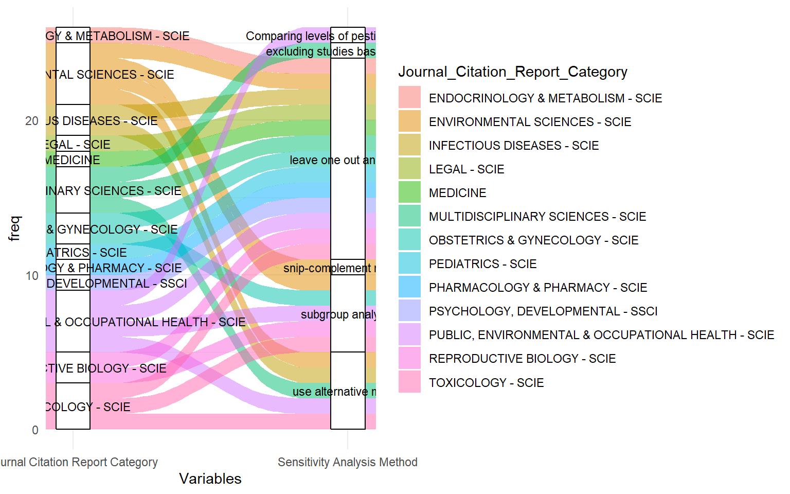

```r
# ggsave(here("figures", "alluvial_het.pdf"), width = 16, height = 10, units = "cm", scale = 2, dpi = 800)
# ggsave(here("figures", "alluvial_het.jpg"), width = 16, height = 10, units = "cm", scale = 2, dpi = 800)
```
 
## Figure s10
Alluvial plot showing the relationship between the Journal Citation Report Category and sensitivity analysis.

```r
# Data Transformation 
sensitivity_analysis_alluvial <- sd %>% 
    separate_rows(sensitivity_analysis_method, sep = ",\\s+") %>%
    separate_rows(Journal_Category_Allocated_Broad, sep = "/\\s+") %>% 
    filter(!is.na(sensitivity_analysis_method)) %>%
    group_by(Journal_Category_Allocated_Broad, sensitivity_analysis_method) %>% 
    count(sensitivity_analysis_method, Journal_Category_Allocated_Broad) %>% 
    summarise(freq = n(), .groups = 'drop') %>% 
    group_by(sensitivity_analysis_method)

# Create the Alluvial plot
alluvial_sens <- sensitivity_analysis_alluvial %>% 
ggplot(aes(y = freq ,axis1 = Journal_Category_Allocated_Broad, axis2 = sensitivity_analysis_method)) +
  scale_x_discrete(limits = c("Journal Citation Category", "Sensitivity Analysis"), expand = c(.05, .05)) +
  xlab("Variables") +
  geom_alluvium(aes(fill = Journal_Category_Allocated_Broad)) +
  geom_stratum(width = 1/4, fill = "white", color = "black") +
  geom_text(stat = "stratum", aes(label = after_stat(stratum)), size = 5) +
  labs(x= "Variables", y = "Frequency", fill = "Journal Category Allocated") +
  scale_fill_brewer(palette = "Dark2") +
  organochlorTHEME() 

alluvial_sens
```

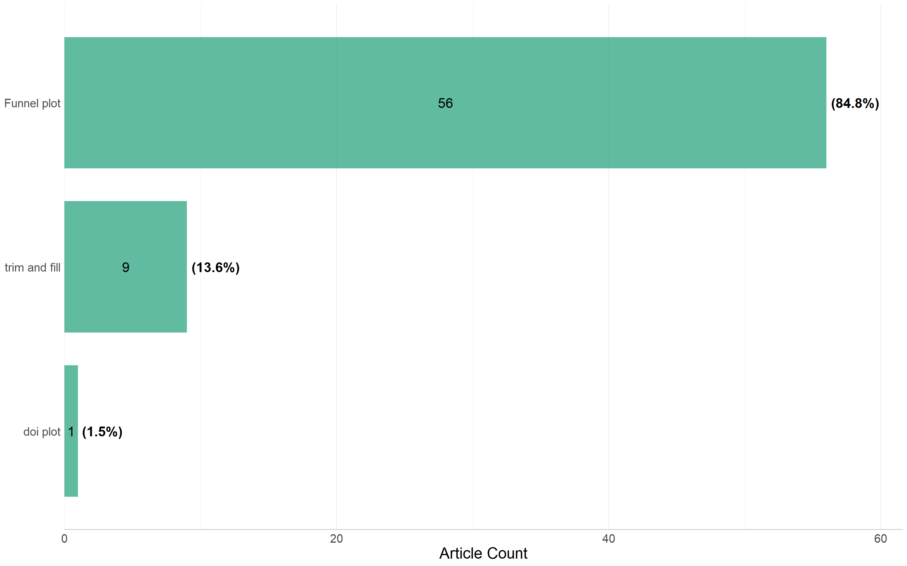

```r
# ggsave(here("figures", "alluvial_sens.pdf"), width = 16, height = 10, units = "cm", scale = 2, dpi = 800)
# ggsave(here("figures", "alluvial_sens.jpg"), width = 16, height = 10, units = "cm", scale = 2, dpi = 800)
```

## Alluvial plot for reporting guideline
An alluvial plot showing the relationship between the Journal Citation Report Category and reporting guideline used 

```r
# Data Transformation 
reporting_standards_alluvial <- sd %>% 
    separate_rows(reporting_standards_type, sep = ",\\s+") %>%
    separate_rows(Journal_Category_Allocated_Broad, sep = "/\\s+") %>%
    filter(!grepl("no category found", Journal_Category_Allocated_Broad, ignore.case = TRUE)) %>% 
    filter(!is.na(reporting_standards_type)) %>%
    group_by(Journal_Category_Allocated_Broad, reporting_standards_type) %>% 
    count(reporting_standards_type, Journal_Category_Allocated_Broad) %>% 
    summarise(freq = n(), .groups = 'drop') %>% 
    group_by(reporting_standards_type)

# Create the Alluvial plot
alluvial_report <- reporting_standards_alluvial %>% 
ggplot( aes(y = freq ,axis1 = Journal_Category_Allocated_Broad, axis2 = reporting_standards_type)) +
  scale_x_discrete(limits = c("Journal Citation Category", "Reporting Standards Type"), expand = c(.05, .05)) +
  xlab("Variables") +
  geom_alluvium(aes(fill = Journal_Category_Allocated_Broad)) +
  geom_stratum(width = 1/3.5, fill = "white", color = "black") +
  labs(x= "Variables", y = "Frequency", fill = "Journal Category Allocated") +
  geom_text(stat = "stratum", aes(label = after_stat(stratum)), size = 6) +
    scale_fill_brewer(palette = "Dark2") +
  organochlorTHEME() 

alluvial_report
```

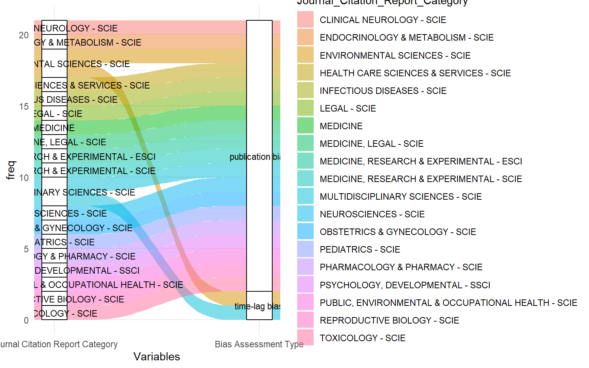

```r
# ggsave(here("figures", "alluvial_report.pdf"), width = 16, height = 10, units = "cm", scale = 2, dpi = 800)
# ggsave(here("figures", "alluvial_report.jpg"), width = 16, height = 10, units = "cm", scale = 2, dpi = 800)
```


## Database bar plot
Bar plot showing the percentage and total count of scientific literature databases used in meta-analyses investigating the impacts of organochlorine pesticides. Note that some meta-analyses may contribute to multiple sections if the study involved multiple scientific literature databases. The "Other databases" category includes all databases with a count of 3 or less. Percentage is showing the proportion of studies.

```r
# Calculate the total count for each category
database_count <- sd %>% 
  separate_rows(database_search, sep = ",\\s+") %>% 
  count(database_search) %>% 
  filter(database_search != "NA") %>% 
  arrange(desc(n)) %>% 
  mutate(database_search = ifelse(n<= 3, "Other databases", as.character(database_search))) %>% 
    group_by(database_search) %>%
  summarise(n = sum(n))

# Calculate proportion and percentage for each category
database_pct <- database_count %>%
  mutate(proportion = n / 83, # 83 is number of studies assessed for CEESAT
         percentage = proportion * 100)

# Create the count plot
database_bar <- database_count %>%
  ggplot(aes(x = n, y = reorder(database_search, n), fill = "#1b9e77")) +
  geom_bar(stat = "identity", width = 0.8 , alpha = 0.7) +
  geom_text(aes(label = n, x = n / 2, y = reorder(database_search, n)), hjust = 0.5, size = 12, color = "black") +
  geom_text(data = database_pct, aes(label = paste0("(", round(percentage, 1), "%)"), x = n), 
            hjust = -0.1, size = 12, color = "black", fontface = "bold") +
  scale_fill_identity(guide = "none") +
  scale_x_continuous(expand = c(0, 0), limits = c(0, max(database_count$n)*1.3)) +
  labs(title = NULL, x = NULL, y = NULL) +
  organochlorTHEME() 

database_bar
```

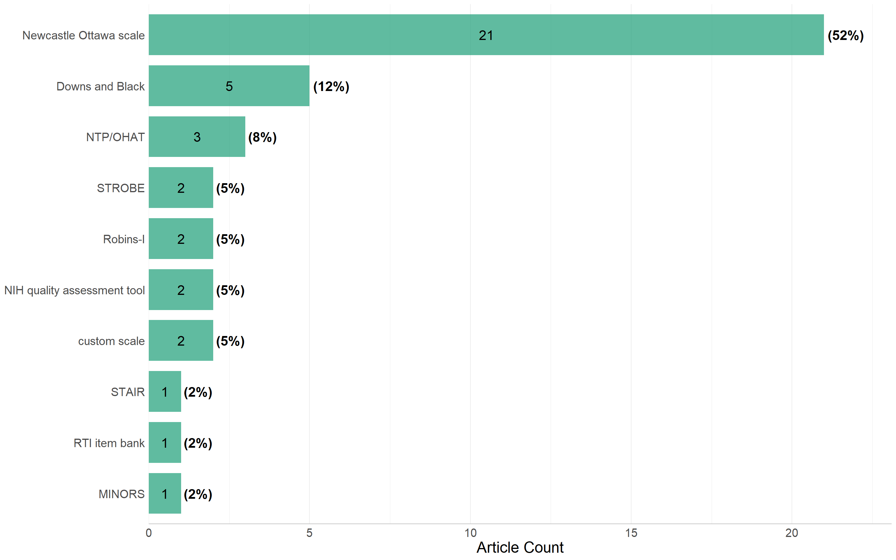

```r
# ggsave(here("figures", "database_bar.pdf"), width = 16, height = 10, units = "cm", scale = 2, dpi = 800)
# ggsave(here("figures", "database_bar.svg"), width = 16, height = 10, units = "cm", scale = 2, dpi = 800)
```

## Alluvial plot for literature database
Alluvial plot showing the relationship between the Journal Citation Report Category and the scientific literature database used. Filtered for scientific literature database counts greater than or equal to 3. 

```r
# Rename Environmental Science
sd <- sd %>%
  mutate(Journal_Category_Allocated_Broad = str_replace(Journal_Category_Allocated_Broad, "Environmental Science", "Environmental\nScience"))

# Data Transformation 
database_alluvial <- sd %>% 
    separate_rows(database_search, sep = ",\\s+") %>%
    group_by(Journal_Category_Allocated_Broad, database_search) %>% 
    count(database_search, Journal_Category_Allocated_Broad) %>% 
    summarise(freq = n(), .groups = 'drop') %>% 
    group_by(database_search) %>% 
    filter(sum(freq) >= 3) %>% 
    filter(database_search != "NA")

# Create the Alluvial plot
alluvial_database <- database_alluvial %>% 
ggplot(aes(y = freq ,axis1 = Journal_Category_Allocated_Broad, axis2 = database_search)) +
  scale_x_discrete(limits = c("Journal Citation Report", "Database Search"), expand = c(.05, .05)) +
  xlab("Variables") +
  ylab("Frequency") +
  geom_alluvium(aes(fill = Journal_Category_Allocated_Broad)) +
  geom_stratum(width = 1/4.5, fill = "white", color = "black") +
  geom_text(stat = "stratum", aes(label = after_stat(stratum)), size = 6) +
  labs(x= "Variables", y = "Frequency", fill = "Journal Category Allocated") +
  scale_fill_brewer(palette = "Dark2") +
  organochlorTHEME() 

alluvial_database
```

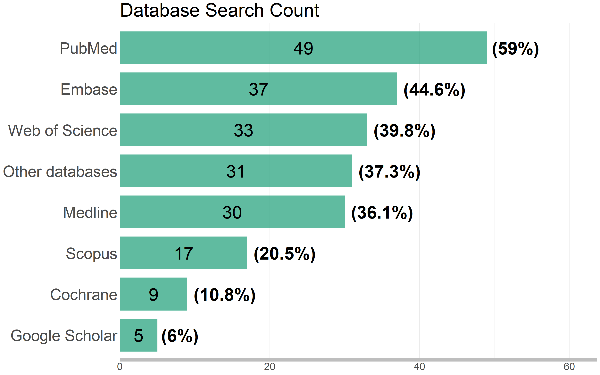

```r
# ggsave(here("figures", "alluvial_database.pdf"), width = 16, height = 10, units = "cm", scale = 2, dpi = 800)
# ggsave(here("figures", "alluvial_database.jpg"), width = 16, height = 10, units = "cm", scale = 2, dpi = 800)
```

## Software bar plot
Bar plot showing the percentage and total count of software for analysis used in meta-analyses investigating the impacts of organochlorine pesticides. Note that some meta-analyses may contribute to multiple sections if the study involved multiple software. Percentage is showing the proportion of studies.

```r
# Calculate the total count for each category
software_count <- sd %>%
  separate_rows(software_analysis, sep = ",\\s+") %>%
  mutate(software_analysis = ifelse(grepl("comprehensive meta-analysis", software_analysis), "CMAS", software_analysis)) %>%
  count(software_analysis) %>%
  filter(software_analysis != "NA") %>%
  arrange(desc(n)) %>%
  mutate(software_analysis = ifelse(n < 2, "Other Software", as.character(software_analysis))) %>%
  group_by(software_analysis) %>%
  summarise(n = sum(n))

# Calculate proportion and percentage for each category
software_pct <- software_count %>%
  mutate(proportion = n / 83,
         percentage = proportion * 100)

# Create the count plot
software_bar <- software_count %>%
  ggplot(aes(x = n, y = reorder(software_analysis, n), fill = "#1b9e77")) +
  geom_bar(stat = "identity", width = 0.8 , alpha = 0.7) +
  geom_text(aes(label = n, x = n / 2, y = reorder(software_analysis, n)), hjust = 0.5, size = 12, color = "black") +
  geom_text(data = software_pct, aes(label = paste0("(", round(percentage, 1), "%)"), x = n), 
            hjust = -0.1, size = 12, color = "black", fontface = "bold") +
  scale_fill_identity(guide = "none") +
  scale_x_continuous(expand = c(0, 0), limits = c(0, max(software_count$n)*1.3)) +
  labs(title = NULL, x = NULL, y = NULL) +
  organochlorTHEME() 

software_bar
```

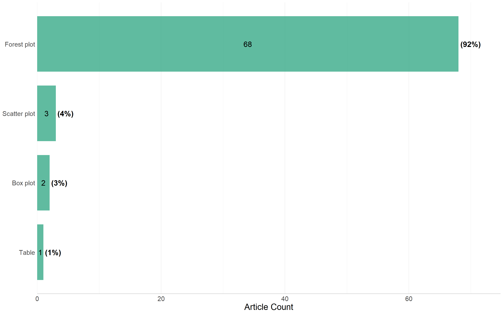

```r
# ggsave(here("figures", "software_bar.pdf"), width = 16, height = 10, units = "cm", scale = 2, dpi = 800)
# ggsave(here("figures", "software_bar.svg"), width = 16, height = 10, units = "cm", scale = 2, dpi = 800)
```

## Alluvial plot for software
Alluvial plot showing the relationship between the Journal Citation Report Category and the software used for analysis.

```r
# Data Transformation 
software_analysis_alluvial <- sd %>% 
    separate_rows(software_analysis, sep = ",\\s+") %>%
    separate_rows(Journal_Category_Allocated_Broad, sep = "/\\s+") %>% 
  mutate(software_analysis = ifelse(grepl("comprehensive meta-analysis", software_analysis), "CMAS", software_analysis)) %>%
  mutate(software_analysis = ifelse(grepl("not reported", software_analysis), "no software reported", software_analysis))  %>% 
    filter(!is.na(software_analysis)) %>%
    group_by(Journal_Category_Allocated_Broad, software_analysis) %>% 
    count(software_analysis, Journal_Category_Allocated_Broad) %>% 
    summarise(freq = n(), .groups = 'drop') %>% 
    group_by(software_analysis)

# Create the Alluvial plot for Software Analysis
alluvial_software <- software_analysis_alluvial %>% 
  ggplot(aes(y = freq ,axis1 = Journal_Category_Allocated_Broad, axis2 = software_analysis)) +
  scale_x_discrete(limits = c("Journal Citation Category", "Software Analysis"), expand = c(.05, .05)) +
  xlab("Variables") +
  geom_alluvium(aes(fill = Journal_Category_Allocated_Broad)) +
  geom_stratum(width = 1/4, fill = "white", color = "black") +
  geom_text(stat = "stratum", aes(label = after_stat(stratum)), size = 6) +
  labs(x= "Variables", y = "Frequency", fill = "Journal Category Allocated") +
  scale_fill_brewer(palette = "Dark2") +
  organochlorTHEME() 

alluvial_software
```

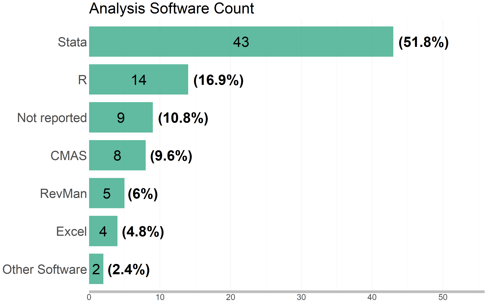

```r
# ggsave(here("figures", "alluvial_software.pdf"), width = 16, height = 10, units = "cm", scale = 2, dpi = 800)
# ggsave(here("figures", "alluvial_software.jpg"), width = 16, height = 10, units = "cm", scale = 2, dpi = 800)
```

## Effect size bar
Bar plot showing the percentage and total count of effect size calculation types used in meta-analyses investigating the impacts of organochlorine pesticides. Note that some meta-analyses may contribute to multiple sections if the study involved multiple effect size calculations. The "Other effect sizes" category includes all effect sizes with a count of 2 or less. Percentage is showing the proportion of studies.

```r
# Calculate the total count for each category
effectsize_count <- sd %>% 
  separate_rows(effect_size, sep = ",\\s+") %>% 
  count(effect_size) %>%
  filter(effect_size != "NA") %>%
  mutate(effect_size = ifelse(n<= 2, "Other effect size", as.character(effect_size))) %>% 
  group_by(effect_size) %>%
  summarise(n = sum(n))

# Calculate proportion and percentage for each category
effectsize_pct <- effectsize_count %>%
  mutate(proportion = n / 83,
         percentage = proportion * 100)

# Create the count plot
effect_bar <-  effectsize_count %>%
  ggplot(aes(x = n, y = reorder(effect_size, n), fill = "#1b9e77")) +
  geom_bar(stat = "identity", width = 0.8 , alpha = 0.7) +
  geom_text(aes(label = n, x = n / 2, y = reorder(effect_size, n)), hjust = 0.5, size = 12, color = "black") +
  geom_text(data = effectsize_pct, aes(label = paste0("(", round(percentage, 1), "%)"), x = n), 
            hjust = -0.1, size = 12, color = "black", fontface = "bold") +
  scale_fill_identity(guide = "none") +
  scale_x_continuous(expand = c(0, 0), limits = c(0, max(effectsize_count$n)*1.3)) +
  labs(title = NULL, x = NULL, y = NULL) +
  organochlorTHEME() 

effect_bar
```

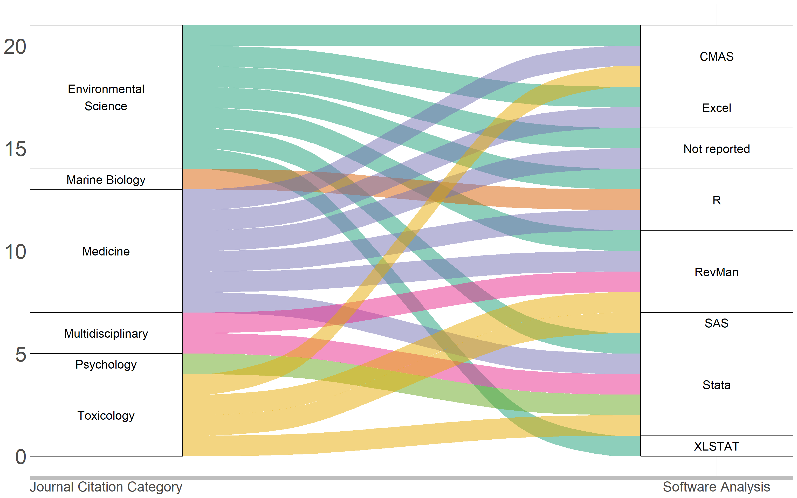

```r
# ggsave(here("figures", "effect_bar.pdf"), width = 16, height = 10, units = "cm", scale = 2, dpi = 800)
# ggsave(here("figures", "effect_bar.svg"), width = 16, height = 10, units = "cm", scale = 2, dpi = 800)
```

## Alluvial plot for effect size estimates
Alluvial plot showing the relationship between the Journal Citation Report Category and the effect size used. Filtered for scientific literature database counts greater than or equal to 3.

```r
# Data Transformation 
effectsize_alluvial <- sd %>% 
    separate_rows(effect_size, sep = ",\\s+") %>%
    separate_rows(Journal_Category_Allocated_Broad, sep = "/\\s+") %>% 
    filter(!grepl("no category found", Journal_Category_Allocated_Broad, ignore.case = TRUE)) %>% 
    filter(!is.na(effect_size)) %>%
    group_by(Journal_Category_Allocated_Broad, effect_size) %>% 
    count(effect_size, Journal_Category_Allocated_Broad) %>% 
    summarise(freq = n(), .groups = 'drop') %>% 
    group_by(effect_size) 


# Create the Alluvial plot
alluvial_effect <- effectsize_alluvial %>% 
ggplot(aes(y = freq ,axis1 = Journal_Category_Allocated_Broad, axis2 = effect_size)) +
  scale_x_discrete(limits = c("Journal Citation Category", "Effect Size"), expand = c(.05, .05)) +
  xlab("Variables") +
  geom_alluvium(aes(fill = Journal_Category_Allocated_Broad)) +
  geom_stratum(width = 1/2.5, fill = "white", color = "black") +
  geom_text(stat = "stratum", aes(label = after_stat(stratum)), size = 5) +
  theme_minimal() +
  labs(x= "Variables", y = "Frequency", fill = "Journal Category Allocated") +
  scale_fill_brewer(palette = "Dark2") +
  organochlorTHEME() 
  
alluvial_effect
```


```r
# ggsave(here("figures", "alluvial_effect.pdf"), width = 16, height = 10, units = "cm", scale = 2, dpi = 800)
# ggsave(here("figures", "alluvial_effect.jpg"), width = 16, height = 10, units = "cm", scale = 2, dpi = 800)
```

## Bar plot for visualisation method
Bar plot showing the percentage and total count of visualization methods used in meta-analyses investigating the impacts of organochlorine pesticides. Note that some meta-analyses may contribute to multiple sections if the study involved the use of multiple visualization methods.

```r
# Calculate the total count for each category
visualization_count <- sd %>% 
  separate_rows(visualization_method, sep = ",\\s+") %>% 
  count(visualization_method) %>%
  filter(visualization_method != "NA") %>%
    group_by(visualization_method) %>%
  summarise(n = sum(n))

# Calculate proportion and percentage for each category
visualization_pct <- visualization_count %>%
  mutate(proportion = n / 83,
         percentage = proportion * 100)

# Create the count plot
bar_vis <- visualization_count %>%
  ggplot(aes(x = n, y = reorder(visualization_method, n), fill = ifelse(grepl("Not reported", visualization_method), "#7370b3", "#1b9e77"))) +
  geom_bar(stat = "identity", width = 0.8 , alpha = 0.7) +
  geom_text(aes(label = n, x = n / 2, y = reorder(visualization_method, n)), hjust = 0.5, size = 12, color = "black") +
  geom_text(data = visualization_pct, aes(label = paste0("(", round(percentage, 0), "%)"), x = n), 
            hjust = -0.1, size = 12, color = "black", fontface = "bold") +
  scale_fill_identity(guide = "none") +
  scale_x_continuous(expand = c(0, 0), limits = c(0, max(visualization_count$n)*1.3)) +
  labs(title = NULL, x = NULL, y = NULL) +
  organochlorTHEME() 

bar_vis
```

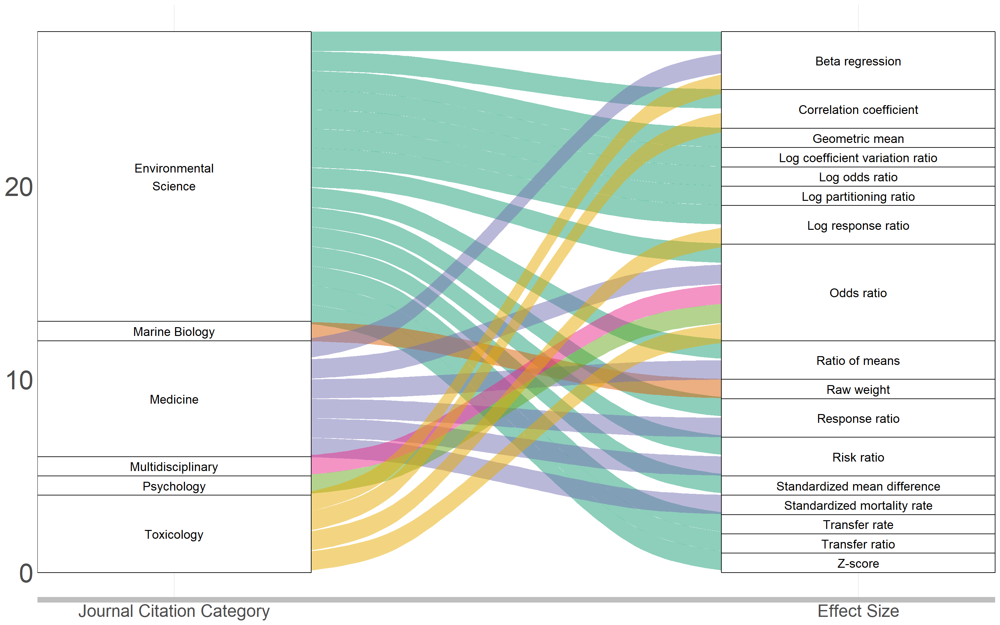

```r
# ggsave(here("figures", "bar_vis.pdf"), width = 16, height = 10, units = "cm", scale = 2, dpi = 800)
# ggsave(here("figures", "bar_vis.svg"), width = 16, height = 10, units = "cm", scale = 2, dpi = 800)
```

## Alluvial plot for visualisation method
Alluvial plot showing the relationship between the Journal Citation Report Category and visualization method. 

```r
# Data Transformation 
visualization_alluvial <- sd %>% 
    separate_rows(visualization_method, sep = ",\\s+") %>%
    filter(!is.na(visualization_method)) %>%
    separate_rows(Journal_Category_Allocated_Broad, sep = "/\\s+") %>%
    group_by(Journal_Category_Allocated_Broad, visualization_method) %>% 
    count(visualization_method, Journal_Category_Allocated_Broad) %>% 
    summarise(freq = n(), .groups = 'drop') %>% 
    group_by(visualization_method) 


# Create the Alluvial plot
alluvial_vis <- visualization_alluvial %>% 
ggplot(aes(y = freq ,axis1 = Journal_Category_Allocated_Broad, axis2 = visualization_method)) +
  scale_x_discrete(limits = c("Journal Citation Report Category", "ROB Assessment Method"), expand = c(.05, .05)) +
  xlab("Variables") +
  geom_alluvium(aes(fill = Journal_Category_Allocated_Broad)) +
  geom_stratum(width = 1/4, fill = "white", color = "black") +
  geom_text(stat = "stratum", aes(label = after_stat(stratum)), size = 6) +
  labs(x= "Variables", y = "Frequency", fill = "Journal Category Allocated") +
  scale_fill_brewer(palette = "Dark2") +
  organochlorTHEME() 

alluvial_vis
```

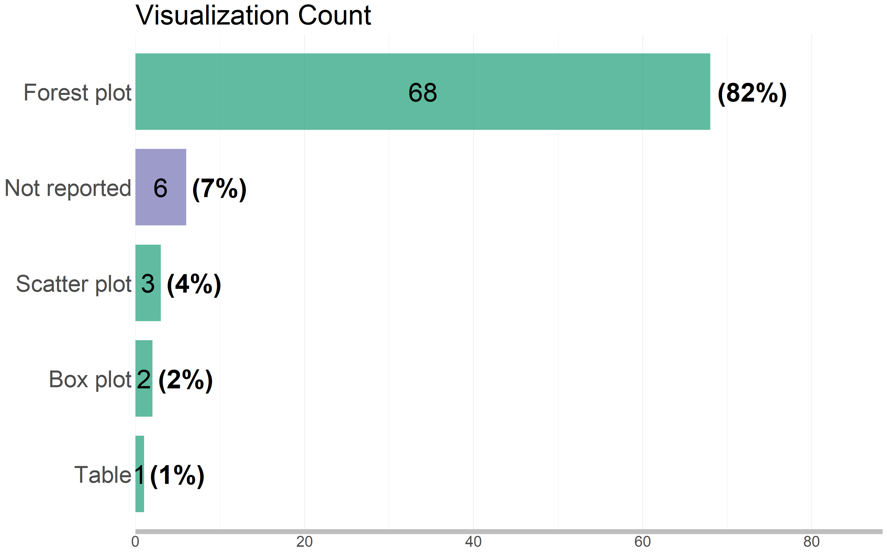

```r
# ggsave(here("figures", "alluvial_vis.pdf"), width = 16, height = 10, units = "cm", scale = 2, dpi = 800)
# ggsave(here("figures", "alluvial_vis.jpg"), width = 16, height = 10, units = "cm", scale = 2, dpi = 800)
```

## Bar plot for risk of bias 
Bar plot showing the percentage and total count of risk of bias tests used in meta-analyses investigating the impacts of organochlorine pesticides. Note that some meta-analyses may contribute to multiple sections if the study involved the use of multiple risk of bias tests. 

```r
# Calculate the total count for each category
rob_method_count <- sd %>% 
  separate_rows(rob_assessment_method, sep = ",\\s+") %>% 
  count(rob_assessment_method) %>%
  filter(rob_assessment_method != "NA") %>%
  mutate(rob_assessment_method = ifelse(n <= 2, "Other ROB tool", as.character(rob_assessment_method))) %>% 
  mutate(rob_assessment_method = ifelse(grepl("Newcastle Ottawa scale", rob_assessment_method), 
                                        "Newcastle Ottawa\nscale", rob_assessment_method)) %>%
  group_by(rob_assessment_method) %>%
  summarise(n = sum(n))

# Calculate proportion and percentage for each category
rob_method_pct <- rob_method_count %>%
  mutate(proportion = n / 83,
         percentage = proportion * 100)

# Create the count plot
bar_risk_of_bias <- rob_method_count %>%
  ggplot(aes(x = n, y = reorder(rob_assessment_method, n), 
             fill = ifelse(grepl("Not reported", rob_assessment_method), "#7370b3", "#1b9e77"))) +
  geom_bar(stat = "identity", width = 0.8 , alpha = 0.7) +
  geom_text(aes(label = n, x = n/2, y = reorder(rob_assessment_method, n)), 
            hjust = 0.5, size = 12, color = "black") +
  geom_text(data = rob_method_pct, aes(label = paste0("(", round(percentage, 0), "%)"), x = n), 
            hjust = -0.1, size = 12, color = "black", fontface = "bold") +
  scale_fill_identity(guide = "none") +
  scale_x_continuous(expand = c(0, 0), limits = c(0, max(rob_method_count$n)*1.3)) +
  labs(title = NULL, x = NULL, y = NULL) +
  organochlorTHEME() 

bar_risk_of_bias
```

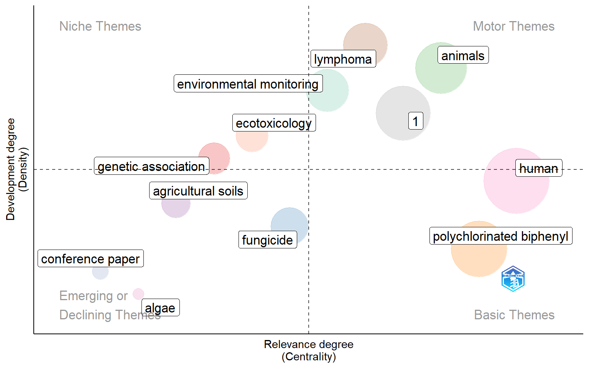

```r
# ggsave(here("figures", "bar_plot_risk_of_bias.pdf"), width = 16, height = 10, units = "cm", scale = 2, dpi = 800)
# ggsave(here("figures", "bar_plot_risk_of_bias.svg"), width = 16, height = 10, units = "cm", scale = 2, dpi = 800)
```

## Alluvial plot for risk of bias
Alluvial plot showing the relationship between the Journal Citation Report Category and risk of bias methodology. 

```r
# Data Transformation 
robmethod_alluvial <- sd %>% 
  separate_rows(rob_assessment_method, sep = ",\\s+") %>%
  filter(!is.na(rob_assessment_method)) %>%
  separate_rows(Journal_Category_Allocated_Broad, sep = "/\\s+") %>%
  group_by(Journal_Category_Allocated_Broad, rob_assessment_method) %>% 
  count(rob_assessment_method, Journal_Category_Allocated_Broad) %>% 
  summarise(freq = n(), .groups = 'drop') %>% 
  group_by(rob_assessment_method) 

# Create the Alluvial plot
alluvial_risk_of_bias <- robmethod_alluvial %>% 
  ggplot(aes(y = freq ,axis1 = Journal_Category_Allocated_Broad, axis2 = rob_assessment_method)) +
  scale_x_discrete(limits = c("Journal Citation Category", "ROB Assessment Method"), expand = c(.05, .05)) +
  xlab("Variables") +
  geom_alluvium(aes(fill = Journal_Category_Allocated_Broad)) +
  geom_stratum(width = 1/3, fill = "white", color = "black") +
  geom_text(stat = "stratum", aes(label = after_stat(stratum)), size = 5) +
  labs(x= "Variables", y = "Frequency", fill = "Journal Category Allocated") +
  scale_fill_brewer(palette = "Dark2") +
  organochlorTHEME() 

alluvial_risk_of_bias
```

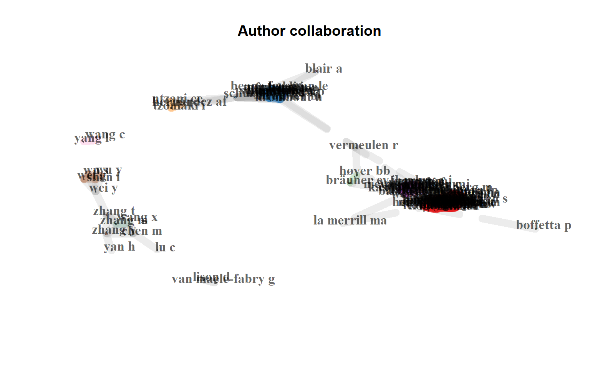

```r
# ggsave(here("figures", "alluvial_plot_risk_of_bias.pdf"), width = 16, height = 10, units = "cm", scale = 2, dpi = 800)
# ggsave(here("figures", "alluvial_plot_risk_of_bias.jpg"), width = 16, height = 10, units = "cm", scale = 2, dpi = 800)
```


## Bar plot for bias visualizations
Bar plot showing the percentage and total count of bias visualizations used in meta-analyses investigating the impacts of organochlorine pesticides. Note that some meta-analyses may contribute to multiple sections if the study involved the use of multiple bias visualizations. 

```r
# Calculate the total count for each category
bias_visualization_count <- sd %>% 
  separate_rows(bias_assessment_visualization, sep = ",\\s+") %>% 
  count(bias_assessment_visualization) %>%
  filter(bias_assessment_visualization != "NA") %>%
  group_by(bias_assessment_visualization) %>%
  summarise(n = sum(n))

# Calculate proportion and percentage for each category
bias_visualization_pct <- bias_visualization_count %>%
  mutate(proportion = n / 83,
         percentage = proportion * 100)

# Create the count plot
bar_bias_visualization <- bias_visualization_count %>%
  ggplot(aes(x = n, y = reorder(bias_assessment_visualization, n), 
             fill = ifelse(grepl("Not reported", bias_assessment_visualization), "#7370b3", "#1b9e77"))) +
  geom_bar(stat = "identity", width = 0.8 , alpha = 0.7) +
  geom_text(aes(label = n, x = n/2, y = reorder(bias_assessment_visualization, n)), 
            hjust = 0.5, size = 12, color = "black") +
  geom_text(data = bias_visualization_pct, aes(label = paste0("(", round(percentage, 1), "%)"), x = n), 
            hjust = -0.1, size = 12, color = "black", fontface = "bold") +
  scale_fill_identity(guide = "none") +
  scale_x_continuous(expand = c(0, 0), limits = c(0, max(bias_visualization_count$n)*1.3)) +
  labs(title = NULL, x = NULL, y = NULL) +
  organochlorTHEME() 

bar_bias_visualization
```

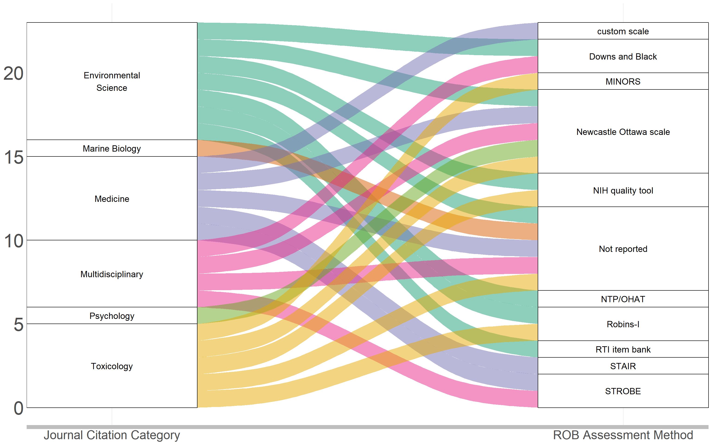

```r
# ggsave(here("figures", "bar_plot_bias_visualization.pdf"), width = 16, height = 10, units = "cm", scale = 2, dpi = 800)
# ggsave(here("figures", "bar_plot_bias_visualization.svg"), width = 16, height = 10, units = "cm", scale = 2, dpi = 800)
```

## Alluvial plot for bias visualization method
Alluvial plot showing the relationship between the Journal Citation Report Category and bias visualization method.

```r
# Data Transformation 
bias_vizualisation_alluvial <- sd %>% 
    separate_rows(bias_assessment_visualization, sep = ",\\s+") %>%
    separate_rows(Journal_Category_Allocated_Broad, sep = "/\\s+") %>% 
    filter(!is.na(bias_assessment_visualization)) %>%
    group_by(Journal_Category_Allocated_Broad, bias_assessment_visualization) %>% 
    count(bias_assessment_visualization, Journal_Category_Allocated_Broad) %>% 
    summarise(freq = n(), .groups = 'drop') %>% 
    group_by(bias_assessment_visualization)

# Create the Alluvial plot
alluvial_bias_visualization <- bias_vizualisation_alluvial %>% 
  ggplot(aes(y = freq, axis1 = Journal_Category_Allocated_Broad, axis2 = bias_assessment_visualization)) +
  scale_x_discrete(limits = c("Journal Citation Category", "Bias Vizualization"), expand = c(.05, .05)) +
  xlab("Variables") +
  geom_alluvium(aes(fill = Journal_Category_Allocated_Broad)) +
  geom_stratum(width = 1/4, fill = "white", color = "black") +
  geom_text(stat = "stratum", aes(label = after_stat(stratum)), size = 6) +
  labs(x= "Variables", y = "Frequency", fill = "Journal Category Allocated") +
  scale_fill_brewer(palette = "Dark2") +
  organochlorTHEME() 

alluvial_bias_visualization
```

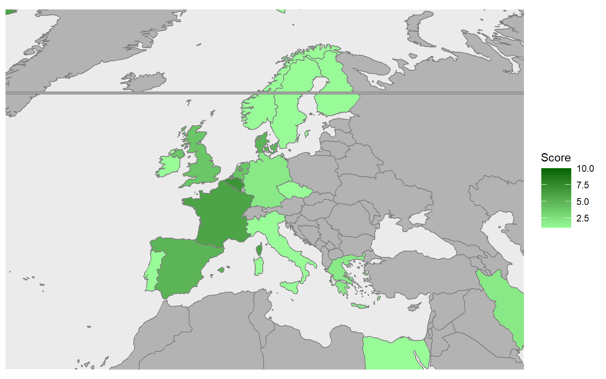

```r
# ggsave(here("figures", "alluvial_plot_bias_visualization.pdf"), width = 16, height = 10, units = "cm", scale = 2, dpi = 800)
# ggsave(here("figures", "alluvial_plot_bias_visualization.svg"), width = 16, height = 10, units = "cm", scale = 2, dpi = 800)
```


## Circular treemap for existing methodological approaches
A circular treemap showing the counts of each methodological item in existing meta-analysis investigating the impacts of organochlorine pesticides

```r
# Grouping "Medline" and "Pubmed" under "PubMed" and summing the counts
database_count <- database_count %>%
  mutate(database_search = if_else(database_search %in% c("Medline", "Pubmed"), "PubMed", database_search)) %>%
  group_by(database_search) %>%
  summarise(n = sum(n))

# Splitting, grouping, and summing different categories of effect sizes
effectsize_count <- sd %>% 
  separate_rows(effect_size, sep = ",\\s+") %>% 
  count(effect_size) %>%
  filter(effect_size != "NA") %>%
  group_by(effect_size) %>%
  summarise(n = sum(n))

effectsize_count <- effectsize_count %>% 
  mutate(effect_size = if_else(effect_size %in% c("Beta regression", "Correlation coefficient"), "Correlation", effect_size)) %>% 
  mutate(effect_size = if_else(effect_size %in% c("Odds ratio", "Response ratio", "Standardized mean difference", "Log partitioning ratio", "Log odds ratio", "Ratio of means", "Log response ratio"), "Mean difference", effect_size)) %>% 
  mutate(effect_size = if_else(effect_size %in% c("Risk ratio"), "2x2", effect_size)) %>% 
  mutate(effect_size = if_else(effect_size %in% c("Raw weight", "Geometric mean", "Maternal transfer ratio", "Standardized mortality rate", "Transfer rate","Transfer ratio", "Z-score", "Log coefficient variation ratio"), "Other ES", effect_size)) %>% 
  group_by(effect_size) %>%
  summarise(n = sum(n))

# Categorizing software as either "Code-based software" or "GUI" and summing the counts
software_count <- software_count %>%
  mutate(software_analysis = if_else(software_analysis %in% c("Stata", "R", "SAS"), "Code-based", software_analysis)) %>%
  mutate(software_analysis = if_else(software_analysis %in% c("CMAS", "Excel", "RevMan", "XLSTAT"), "GUI", software_analysis)) %>% 
  mutate(software_analysis = if_else(software_analysis %in% c("Not reported"), "No software reported", software_analysis)) %>%
  group_by(software_analysis) %>%
  summarise(n = sum(n))

# Grouping heterogeneity assessment methods and summing the counts
heterogeneity_count <- heterogeneity_count %>% 
  mutate(heterogeneity_assessment_method = if_else(heterogeneity_assessment_method %in% c("Tau square"), "I squared", heterogeneity_assessment_method)) %>% 
  mutate(heterogeneity_assessment_method = if_else(heterogeneity_assessment_method %in% c("Chi square"), "Q statistic", heterogeneity_assessment_method)) %>% 
  mutate(heterogeneity_assessment_method = if_else(heterogeneity_assessment_method %in% c("Not reported"), "No heterogeneity reported", heterogeneity_assessment_method)) %>% 
  group_by(heterogeneity_assessment_method) %>%
  summarise(n = sum(n))

# Grouping bias assessment methods with count <= 3 under "Other BA" and summing the counts
bias_method_count <- bias_method_count %>% 
  mutate(bias_assessment_method = if_else(bias_assessment_method %in% c("Egger's regression test", "Fail safe", "Begg's test", "Kendall's tau statistic"),"Bias statistical test", bias_assessment_method)) %>% 
    mutate(bias_assessment_method = if_else(bias_assessment_method %in% c("Not reported"),"No bias assessment reported", bias_assessment_method)) %>% 
  group_by(bias_assessment_method) %>%
  summarise(n = sum(n))

# Grouping sensitivity analysis methods and summing the counts
sensitivity_count <-  sensitivity_count %>%  
  mutate(sensitivity_analysis_method = if_else(n<= 8, "Other sensitivity analysis", as.character(sensitivity_analysis_method))) %>% 
   mutate(sensitivity_analysis_method = if_else(sensitivity_analysis_method %in% c("Not reported"), "No sensitivity analysis reported",sensitivity_analysis_method)) %>% 
  group_by(sensitivity_analysis_method) %>%
  summarise(n = sum(n))

# Grouping risk of bias assessment methods with count <= 3 under "Other ROB" and summing the counts
rob_method_count <-  rob_method_count %>%  
  mutate(rob_assessment_method = if_else(n<= 3, "Other ROB tool", as.character(rob_assessment_method))) %>% 
    mutate(rob_assessment_method = if_else(rob_assessment_method %in% c("Not reported"), "No risk of bias reported", rob_assessment_method)) %>% 
  group_by(rob_assessment_method) %>%
  summarise(n = sum(n))

# Grouping visualization methods with count <= 3 under "Other Viz" and summing the counts
visualization_count <- visualization_count %>% 
   mutate(visualization_method = if_else(n<= 3, "Other Viz", as.character(visualization_method))) %>% 
  mutate(visualization_method = if_else(visualization_method %in% c("Not reported"), "No vizualization reported", visualization_method)) %>% 
  group_by(visualization_method) %>%
  summarise(n = sum(n))

# Grouping reporting standards types with count <= 2 under "Other guideline" and summing the counts
reporting_guide_count <- reporting_guide_count %>% 
  mutate(reporting_standards_type = ifelse(n<= 2, "Other guideline", as.character(reporting_standards_type))) %>% 
  mutate(reporting_standards_type = ifelse(reporting_standards_type %in% c("Not reported"), "No reporting guideline reported",reporting_standards_type)) %>% 
  group_by(reporting_standards_type) %>%
  summarise(n = sum(n))

# Grouping bias assessment visualization types and summing the counts
bias_visualization_count <- bias_visualization_count %>% 
  mutate(bias_assessment_visualization = if_else(bias_assessment_visualization %in% c("Doi plot", "Trim and fill", "Funnel plot", "Galbraith plot"), "Bias visualization", bias_assessment_visualization)) %>% 
  mutate(bias_assessment_visualization = if_else(bias_assessment_visualization %in% c("Not reported"), "No bias visualization reported", bias_assessment_visualization)) %>% 
  group_by(bias_assessment_visualization) %>%
  summarise(n = sum(n))

# Combine the data frames and unite the methodology types
df <- bind_rows(
  database_count %>% mutate(methodology_type = 'Database Search'),
  effectsize_count %>% mutate(methodology_type = 'Effect Size'),
  software_count %>%  mutate(methodology_type = "Software"),
  heterogeneity_count %>% mutate(methodology_type = "Heterogeneity"),
  sensitivity_count %>% mutate(methodology_type = "Sensitivity_Analysis"),
  bias_method_count %>%  mutate(methodology_type = "Bias Assessment"),
  rob_method_count %>% mutate(methodology_type = "Risk  of Bias"), 
 # visualization_count %>% mutate(methodology_type = "Visualization"),
  reporting_guide_count %>%  mutate(methodology_type = "Reporting Guide"),
  bias_visualization_count %>%  mutate(methodology_type = "Bias Assessment")
) %>% 
 unite(methodology_type_specific, 
       database_search, 
       effect_size,  
       software_analysis,
       heterogeneity_assessment_method, 
       sensitivity_analysis_method, 
       bias_assessment_method,
       rob_assessment_method, 
      # visualization_method, 
       reporting_standards_type, 
       bias_assessment_visualization,
       remove = TRUE, na.rm = TRUE)

# Preparing the edges dataframe for creating the graph
edges <- df %>%
  rename(from = methodology_type, to = methodology_type_specific, size = n) %>%
  select(c(from,to,size)) %>%
  as.data.frame()

# Preparing the vertices dataframe for creating the graph
vertices <- df  %>%
  rename(name = methodology_type_specific, size = n) %>%
  select(c(name,size)) %>%
  as.data.frame()

# Appending unique 'from' values to vertices and their corresponding summed sizes
vertices[(nrow(edges)+1):(nrow(edges)+length(unique(edges$from))),1] <- unique(edges$from)
N <- aggregate(edges$size, list(edges$from), FUN=sum)
vertices[(nrow(edges)+1):(nrow(edges)+length(unique(edges$from))),2] <- N$x

# Creating a graph object from the edges and vertices dataframes
mygraph <- graph_from_data_frame(edges, vertices = vertices)

# Plotting the graph using a 'circlepack' layout
circular_treemap_methods <- ggraph(mygraph, layout = 'circlepack', weight = size) + 
    geom_node_circle(aes(fill = as.factor(depth)), color = NA) +
    scale_fill_manual(values = c("#1b9e77", "#88D1AD")) + 
    geom_node_text(aes(label = name, filter = leaf, size = 10), vjust = -0.3, fontface = "bold") +
    geom_node_text(aes(label = paste0("(", size, ")"), filter = leaf, size = 10), vjust = 1, fontface = "bold") +
    theme_void() +
    theme(legend.position = "none") 

circular_treemap_methods
```

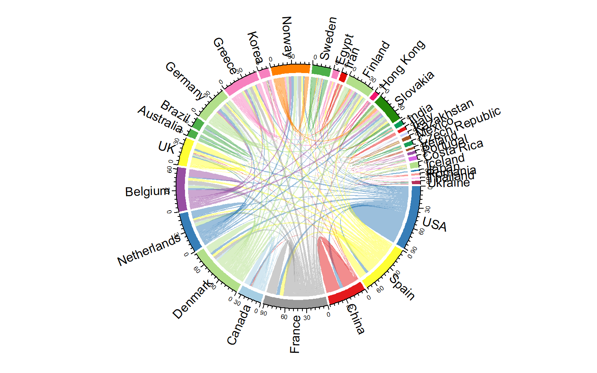

```r
# ggsave(here("figures", "circular_treemap_methods.pdf"), width = 18, height = 15, units = "cm", scale = 2, dpi = 800)
# ggsave(here("figures", "circular_treemap_methods.jpg"), width = 18, height = 15, units = "cm", scale = 2, dpi = 800)
```

## Donut plot for confound analysis
Donut plot showing the proportion of studies which included confounds (through risk of bias assessments) in the analysis (green = not reported, orange = reported).

```r
# Remove NA values and count Yes/No
confound_data <- sd %>%
  filter(!is.na(confound_analysis)) %>%
  count(confound_analysis) %>%
  mutate(percentage = n / sum(n) * 100)

# Donut Plot with a hole
donut_plot <- ggplot(confound_data, aes(x = 2, y = percentage, fill = confound_analysis)) +
  geom_bar(stat = "identity", width = 1, color = "white") +
  coord_polar(theta = "y", start = 0) +
  geom_text(
    aes(label = paste0(round(percentage, 1), "%")), 
    position = position_stack(vjust = 0.5), 
    size = 5, 
    fontface = "bold",
    color = "white"
  ) +
  scale_fill_manual(values = c("yes" = "#d95f02", "no" = "#1b9e77")) +  # Custom colors
  labs(fill = NULL) +  # Remove legend title
  theme_void() +
  theme(
    legend.position = "none",  # Remove legend
    plot.title = element_text(size = 16, face = "bold", hjust = 0.5)
  ) +
  xlim(0.5, 2.5)  # Creates the hole in the middle

# Save figures
# ggsave(here("figures", "donut_confound.pdf"), plot = donut_plot, width = 8, height = 8, units = "cm", dpi = 800)
# ggsave(here("figures", "donut_confound.svg"), plot = donut_plot, width = 8, height = 8, units = "cm", dpi = 800)
```


# Section 2 
To explore the various characteristics of the organochlorine pesticides literature such as the pesticides used, the impacts elicited in response and the subjects that were investigated.

## Bar plot for organochlorine pesticides investigated

A bar plot showing the percentage and total count of total of pesticides investigate in meta-analysis investigating the impacts of organochlorine pesticides. Note: some meta-analysis may contribute to multiple sections if the study involves multiple organochlorine pesticides. Filtered for pesticide counts greater than 6. 

```r
# Function to replace long OCP names with abbreviations
replace_ocp <- function(df) {
  df %>% 
    mutate(ocp = case_when(
      # HCH related replacements
      grepl("Hexachlorocyclohexane \\(HCH\\)", ocp, ignore.case = TRUE) ~ "HCH",
      grepl("alpha-Hexachlorocyclohexane \\(alpha-HCH\\)", ocp, ignore.case = TRUE) ~ "α - HCH",
      grepl("beta-Hexachlorocyclohexane \\(beta-HCH\\)", ocp, ignore.case = TRUE) ~ "β - HCH",
      grepl("gamma-Hexachlorocyclohexane \\(gamma-HCH\\)", ocp, ignore.case = TRUE) ~ "Lindane",
      # DDT related replacements
      grepl("Dichlorodiphenyltrichloroethane \\(DDT\\)", ocp, ignore.case = TRUE) ~ "DDT",
      grepl("p,p-Dichlorodiphenyltrichloroethane \\(p,p-DDT\\)", ocp, ignore.case = TRUE) ~ "p,p-DDT",
      grepl("o,p-Dichlorodiphenyltrichloroethane \\(o,p-DDT\\)", ocp, ignore.case = TRUE) ~ "o,p-DDT",
      # DDD related replacements
      grepl("Dichlorodiphenyldichloroethane \\(DDD\\)", ocp, ignore.case = TRUE) ~ "DDD",
      grepl("p,p-Dichlorodiphenyldichloroethane \\(p,p-DDD\\)", ocp, ignore.case = TRUE) ~ "p,p-DDD",
      grepl("o,p-Dichlorodiphenyldichloroethane \\(o,p-DDD\\)", ocp, ignore.case = TRUE) ~ "o,p-DDD",
      # DDE related replacements
      grepl("Dichlorodiphenyldichloroethylene \\(DDE\\)", ocp, ignore.case = TRUE) ~ "DDE",
      grepl("p,p-Dichlorodiphenyldichloroethylene \\(p,p-DDE\\)", ocp, ignore.case = TRUE) ~ "p,p-DDE",
      grepl("o,p-Dichlorodiphenyldichloroethylene \\(o,p-DDE\\)", ocp, ignore.case = TRUE) ~ "o,p-DDE",
      TRUE ~ ocp  # no change for any others
    ))
}

# Transform the data 
ocp_count <- ocp %>% 
  separate_rows(ocp, sep = ",\\s+") %>% 
  replace_ocp() %>% 
  count(ocp) %>% 
  filter(!is.na(ocp)) %>%  # filter out NA 
  arrange(desc(n)) %>% 
  mutate(ocp = ifelse(n <= 6, "other OCP", as.character(ocp))) %>% 
  group_by(ocp) %>% 
  summarise(n = sum(n))

# Calculate the proportion and percentage of each OCP
ocp_pct <- ocp_count %>%
  mutate(proportion = n / 104,
         percentage = proportion * 100)

# Create the count plot for OCPs
bar_plot_ocp <- ocp_count %>%
  ggplot(aes(x = n, y = reorder(ocp, n), fill = "#1b9e77")) +
  geom_bar(stat = "identity", width = 0.8, alpha = 0.7) +
  geom_text(aes(label = n, x = n / 2, y = reorder(ocp, n)),
            hjust = 0.5, size = 7, color = "black") +
  geom_text(data = ocp_pct,
            aes(label = paste0("(", round(percentage, 1), "%)"), x = n),
            hjust = -0.1, size = 7, color = "black", fontface = "bold") +
  scale_fill_identity(guide = "none") +
  scale_x_continuous(name = "Article Count", expand = c(0, 0), limits = c(0, max(ocp_count$n)*1.2)) +
  labs(title = NULL, x = NULL, y = NULL) +
  organochlorTHEME() +
  theme(axis.text.y = element_text(size = 20))  

bar_plot_ocp
```


```r
# ggsave(here("figures", "bar_plot_pesticide_investigation.pdf"), 
#        plot = bar_plot_ocp, width = 25, height = 15, units = "cm", scale = 2, dpi = 800)
# ggsave(here("figures", "bar_plot_pesticide_investigation.svg"), 
#        plot = bar_plot_ocp, width = 25, height = 15, units = "cm", scale = 2, dpi = 800)
```

## Bar plot for subjects investigated
A bar plot showing the percentage and total count of total of subjects investigate in meta-analysis investigating the impacts of organochlorine pesticides. Note: some meta-analysis may contribute to multiple sections if the study involves multiple subjects

```r
# Calculate total count for each category
subject_count <- sub %>% 
  separate_rows(subject, sep = ",\\s+") %>% 
  mutate(subject = ifelse(grepl("Non-human animal", subject, ignore.case = TRUE),
                          "Non-human\nanimal", subject)) %>% 
  count(subject)

# Calculate proportion and percentage for each category
subject_pct <- subject_count %>%
  mutate(proportion = n / 105,
         percentage = proportion * 100)

# Create the count plot for subjects
bar_plot_subject <- subject_count %>%
  ggplot(aes(x = n, y = reorder(subject, n), fill = "#1b9e77")) +
  geom_bar(stat = "identity", width = 0.8 , alpha = 0.7) +
  geom_text(aes(label = n, x = n / 2, y = reorder(subject, n)), 
            hjust = 0.5, size = 12, color = "black") +
  geom_text(data = subject_pct, 
            aes(label = paste0("(", round(percentage, 1), "%)"), x = n),
            hjust = -0.1, size = 12, color = "black", fontface = "bold") +
  scale_fill_identity(guide = "none") +
  scale_x_continuous(name = "Article Count", expand = c(0, 0), limits = c(0, max(subject_count$n)*1.2)) +
  labs(title = NULL, x = NULL, y = NULL) +
  organochlorTHEME()

bar_plot_subject
```

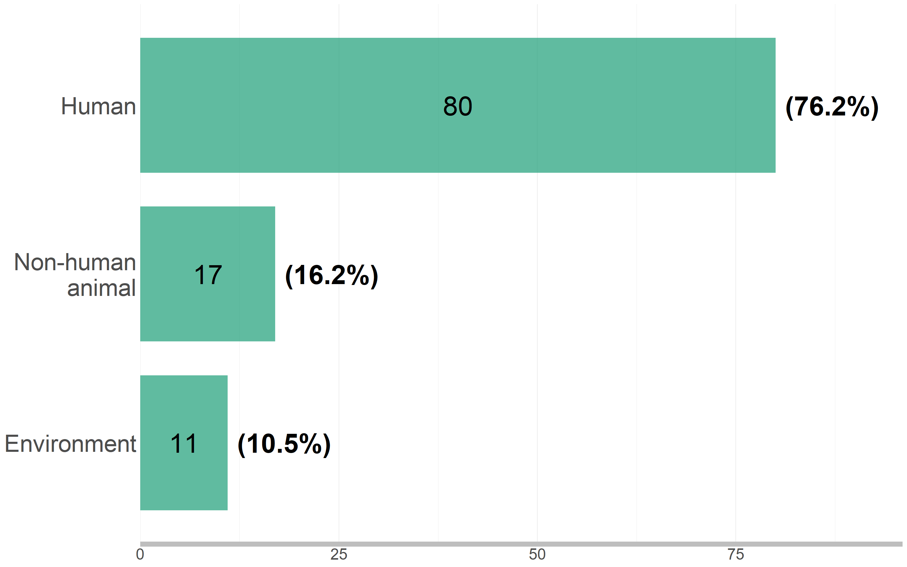

```r
# ggsave(here("figures", "bar_plot_subject_investigation.pdf"), 
#        plot = bar_plot_subject, width = 25, height = 15, units = "cm", scale = 2, dpi = 800)
# ggsave(here("figures", "bar_plot_subject_investigation.svg"), 
#        plot = bar_plot_subject, width = 25, height = 15, units = "cm", scale = 2, dpi = 800)
```

## Bar plot for impacts investigated (filtered)
A bar plot showing the percentage and total count of total of subjects investigate in meta-analysis investigating the impacts of organochlorine pesticides. Note: some meta-analysis may contribute to multiple sections if the study involves multiple subjects. Filtered for impact counts greater than 1. 

```r
# Calculate total count for each category
impact_count <- im %>% 
  separate_rows(impact, sep = ",\\s+") %>% 
  count(impact) %>% 
  filter(impact != "NA") %>% 
  mutate(impact = ifelse(n <= 2, "other", as.character(impact))) %>% 
  group_by(impact) %>%
  summarise(n = sum(n))

# Calculate proportion and percentage for each category
impact_pct <- impact_count %>%
  mutate(proportion = n / sum(impact_count$n),
         percentage = proportion * 100)

# Create the count plot for impacts 
bar_plot_impact_filtered <- impact_count %>%
  ggplot(aes(x = n, y = reorder(impact, n), fill = "#1b9e77")) +
  geom_bar(stat = "identity", width = 0.8 , alpha = 0.7) +
  geom_text(aes(label = n, x = n / 2, y = reorder(impact, n)),
            hjust = 0.5, size = 10, color = "black") +
  geom_text(data = impact_pct,
            aes(label = paste0("(", round(percentage, 1), "%)"), x = n),
            hjust = -0.1, size = 10, color = "black", fontface = "bold") +
  scale_fill_identity(guide = "none") +
  scale_x_continuous(name = "Article Count", expand = c(0, 0), limits = c(0, max(impact_count$n)*1.3)) +
  labs(title = NULL, x = NULL, y = NULL) +
  organochlorTHEME()

bar_plot_impact_filtered
```

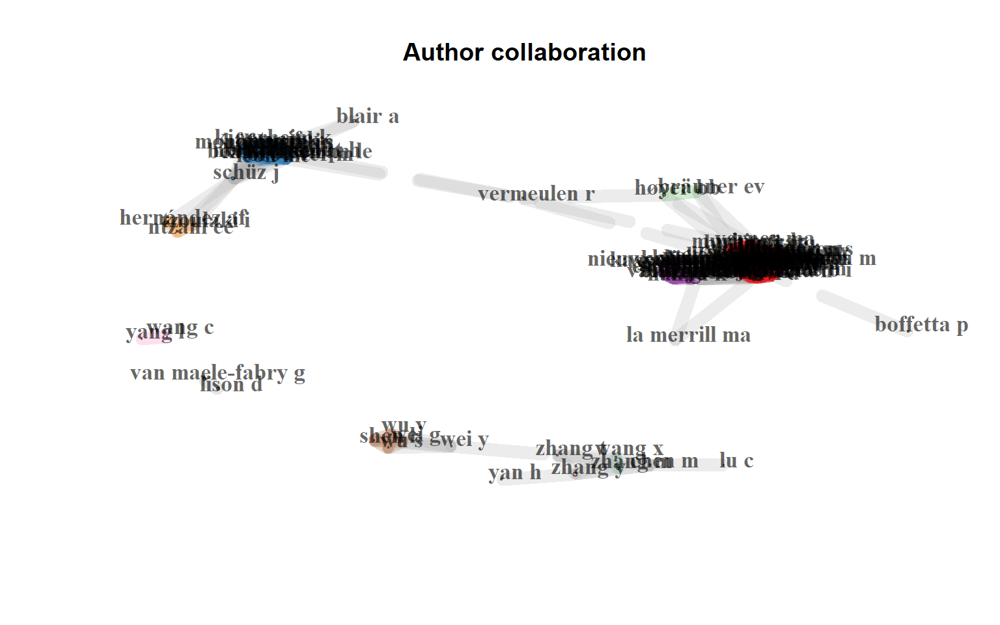

```r
# ggsave(here("figures", "bar_plot_impact_investigated_filtered.pdf"),
#        plot = bar_plot_impact_filtered, width = 25, height = 15, units = "cm", scale = 2, dpi = 800)
# ggsave(here("figures", "bar_plot_impact_investigated_filtered.jpg"),
#        plot = bar_plot_impact_filtered, width = 25, height = 15, units = "cm", scale = 2, dpi = 800)
```

## Bar plot for broad impact categories

A bar plot showing the percentage and total count of total of impact categories investigated in meta-analysis investigating the impacts of organochlorine pesticides. 
Note: some meta-analysis may contribute to multiple sections if the study involves multiple impacts

```r
# Create a column for broad impacts
im <- im %>%
  separate_rows(impact, sep = ",\\s+") %>% 
  mutate(impact_broad = case_when(
    impact %in% c("parkinsons disease", "alzheimers disease", "autism spectrum disorder", 
                  "brain tumour", "amyotrophic lateral sclerosis") ~ "Neurological",
    impact %in% c("concentration", "contamination") ~ "Concentration",
    impact %in% c("diabetes", "thyroid function", "hypertension", "endometriosis") ~ "Endocrine",
    grepl("cancer", impact, ignore.case = TRUE) |
      impact %in% c("leukemia", "lymphoma", "multiple myeloma", "neuroblastoma") ~ "Carcinogen",
    impact %in% c("respiratory health", "cardiovascular disease", "asthma", "prolonged bradycardia") ~ "Cardiovascular",
    impact %in% c("obesity", "adiposity") ~ "Obesity",
    impact %in% c("sperm quality", "neuroblastoma", "hypospadias", "cryptochidism", 
                  "reproductive system") ~ "Reproduction",
    TRUE ~ "Other Impact"
  ))

# Calculate total count for each category
impact_count_broad <- im %>% 
  separate_rows(impact_broad, sep = ",\\s+") %>% 
  count(impact_broad) %>% 
  filter(impact_broad != "NA") %>% 
  group_by(impact_broad) %>% 
  summarise(n = sum(n))

# Calculate proportion and percentage for each category
impact_pct_broad <- impact_count_broad %>%
  mutate(proportion = n / 105,
         percentage = proportion * 100)

# Create the count plot for impacts 
bar_plot_impact_broad <- impact_count_broad %>%
  ggplot(aes(x = n, y = reorder(impact_broad, n), fill = "#1b9e77")) +
  geom_bar(stat = "identity", width = 0.8 , alpha = 0.7) +
  geom_text(aes(label = n, x = n / 2, y = reorder(impact_broad, n)),
            hjust = 0.5, size = 10, color = "black") +
  geom_text(data = impact_pct_broad,
            aes(label = paste0("(", round(percentage, 1), "%)"), x = n),
            hjust = -0.1, size = 10, color = "black", fontface = "bold") +
  scale_fill_identity(guide = "none") +
  scale_x_continuous(name = "Article Count", expand = c(0, 0), limits = c(0, max(impact_count_broad$n)*1.3)) +
  labs(title = NULL, x = NULL, y = NULL) +
  organochlorTHEME()

bar_plot_impact_broad
```

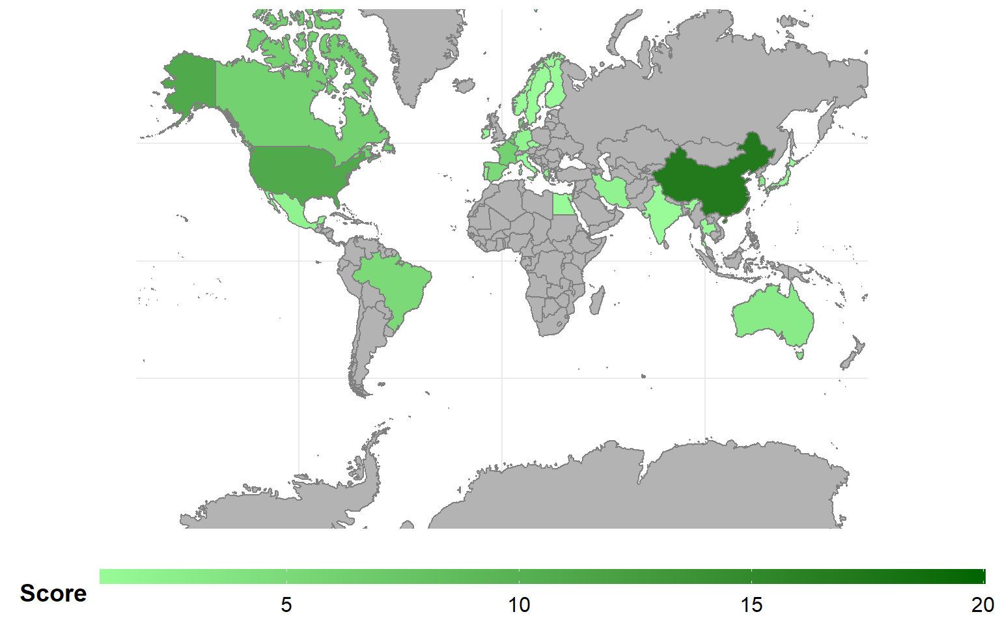

```r
# ggsave(here("figures", "bar_plot_broad_impact_category.pdf"),
#        plot = bar_plot_impact_broad, width = 25, height = 15, units = "cm", scale = 2, dpi = 800)
# ggsave(here("figures", "bar_plot_broad_impact_category.svg"),
#        plot = bar_plot_impact_broad, width = 25, height = 15, units = "cm", scale = 2, dpi = 800)
```

## Alluvial plot: pesticide exposure, subject, and impact

An alluvial plot showing the relationships between the pesticide of exposure, the subject being exposed and the impact of exposure 

```r
# Function to change OCP to be more general
replace_ocp2 <- function(df) {
  df %>% 
    mutate(ocp = case_when(
      grepl("Chlordane", ocp, ignore.case = TRUE) ~ "Chlordane",  
      grepl("Endosulfan", ocp, ignore.case = TRUE) ~ "Endosulfan", 
      grepl("Nonachlor", ocp, ignore.case = TRUE) ~ "Nonachlore", 
      grepl("Heptachlor", ocp, ignore.case = TRUE) ~ "Heptachlor",
      grepl("TCDD", ocp, ignore.case = TRUE) ~ "TCDD", 
      grepl("Endrin", ocp, ignore.case = TRUE) ~ "Endrin",
      grepl("Hexachlorobenzene", ocp, ignore.case = TRUE) ~ "HCH",
      grepl("Lindane", ocp, ignore.case = TRUE) ~ "HCH", 
      grepl("Hexachlorocyclohexane \\(HCH\\)", ocp, ignore.case = TRUE) ~ "HCH",
      grepl("alpha-Hexachlorocyclohexane \\(alpha-HCH\\)", ocp, ignore.case = TRUE) ~ "HCH",
      grepl("beta-Hexachlorocyclohexane \\(beta-HCH\\)", ocp, ignore.case = TRUE) ~ "HCH",
      grepl("gamma-Hexachlorocyclohexane \\(gamma-HCH\\)", ocp, ignore.case = TRUE) ~ "HCH",
      grepl("Dichlorodiphenyltrichloroethane \\(DDT\\)", ocp, ignore.case = TRUE) ~ "DDT",
      grepl("p,p-Dichlorodiphenyltrichloroethane \\(p,p-DDT\\)", ocp, ignore.case = TRUE) ~ "DDT",
      grepl("o,p-Dichlorodiphenyltrichloroethane \\(o,p-DDT\\)", ocp, ignore.case = TRUE) ~ "DDT",
      grepl("Dichlorodiphenyldichloroethane \\(DDD\\)", ocp, ignore.case = TRUE) ~ "DDD",
      grepl("p,p-Dichlorodiphenyldichloroethane \\(p,p-DDD\\)", ocp, ignore.case = TRUE) ~ "DDD",
      grepl("o,p-Dichlorodiphenyldichloroethane \\(o,p-DDD\\)", ocp, ignore.case = TRUE) ~ "DDD",
      grepl("Dichlorodiphenyldichloroethylene \\(DDE\\)", ocp, ignore.case = TRUE) ~ "DDE",
      grepl("p,p-Dichlorodiphenyldichloroethylene \\(p,p-DDE\\)", ocp, ignore.case = TRUE) ~ "DDE",
      grepl("o,p-Dichlorodiphenyldichloroethylene \\(o,p-DDE\\)", ocp, ignore.case = TRUE) ~ "DDE",
      TRUE ~ ocp
    ))
}

# Transform the data 
alluvial_data <- im %>%
  left_join(ocp, by = "study_id") %>%
  left_join(sub, by = "study_id") %>%
  separate_rows(subject, sep = ",\\s+") %>% 
  separate_rows(ocp, sep = ",\\s+") %>% 
  separate_rows(impact_broad, sep = ",\\s+") %>%
  replace_ocp2() %>%
  filter(!grepl("not reported", ocp, ignore.case = TRUE)) %>%
  group_by(ocp, subject, impact_broad) %>%
  summarise(freq = n(), .groups = 'drop') %>%
  group_by(ocp) %>%
  filter(sum(freq) > 10) %>%  
  group_by(impact_broad) %>% 
  filter(sum(freq) > 5) %>% 
  mutate(subject = factor(subject, levels = c("Environment", "Non-human animal", "Human"), ordered = TRUE))

# Make alluvial plot
alluvial_plot_exposure <- alluvial_data %>% 
  ggplot(aes(axis1 = ocp, axis2 = subject, axis3 = impact_broad, y = freq)) +
  scale_x_discrete(limits = c("Organochlorine Pesticide", "Subject", "Impact"), expand = c(.05, .10)) +
  xlab("Variables") +
  ylab("Frequency") +  
  geom_alluvium(aes(fill = subject)) +
  geom_stratum(width = 1/2, fill = "white", color = "black") +
  geom_text(stat = "stratum", aes(label = after_stat(stratum)), size = 5, fontface = "bold") +  
  theme_minimal() +
  theme(axis.text = element_text(size = 15),  
        axis.title = element_text(size = 20),
        legend.position = "none",
        panel.grid.major = element_blank(),  
        panel.grid.minor = element_blank()) + 
  scale_fill_brewer(palette = "Dark2", name = "Subject Category")

alluvial_plot_exposure
```

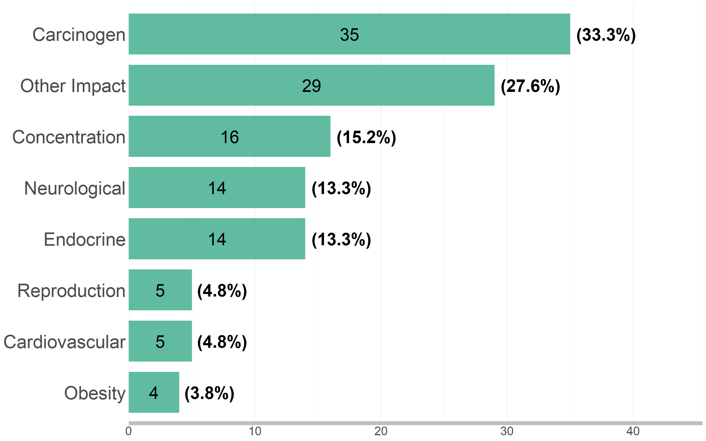

```r
# ggsave(here("figures", "alluvial_plot_exposure_subject_impact.pdf"), 
#        plot = alluvial_plot_exposure, width = 25, height = 15, units = "cm", scale = 2, dpi = 800)
# ggsave(here("figures", "alluvial_plot_exposure_subject_impact.jpg"), 
#        plot = alluvial_plot_exposure, width = 25, height = 15, units = "cm", scale = 2, dpi = 800)


# ggsave(here("figures", "figs29.pdf"), width =18, height = 12, units = "cm", scale = 2, dpi = 800)
# ggsave(here("figures", "figs29.jpg"), width = 18, height = 12, units = "cm", scale = 2, dpi = 800)
```

## Figure 4
A bubble plot showing the counts of each pesticide per impact included in current meta-analysis on the impacts of organochlorine pesticides 

```r
# Join the organochlorine pesticide details with the impact details
ocp_im <- left_join(ocp, im ,sub, by = "study_id") 

# Separate rows in "ocp_im"
ocp_im1 <- separate_rows(ocp_im, ocp , sep = ", ", convert = TRUE)


# Group by "ocp" and "impact" and summarize count
ocp_im_summary <- ocp_im1 %>%
  mutate(ocp = str_trim(ocp),
         impact_broad = str_trim(impact_broad)) %>%
    replace_ocp2() %>% 
  group_by(ocp, impact_broad) %>%
  summarise(count = n(), .groups = "drop") %>% 
  mutate(ocp = ifelse(grepl("no chemical classification", ocp, ignore.case = TRUE), "no chemical\n classification", ocp))

# Filter for top 8 pesticides 
top_pesticides <- ocp_im_summary %>%
  filter(ocp != "not reported") %>%
  group_by(ocp) %>%
  summarise(total_count = sum(count)) %>%
  top_n(8, total_count) %>%
  pull(ocp) 


ocp_im_summary_filtered <- ocp_im_summary %>%
  filter(ocp %in% top_pesticides)

fig4 <- ocp_im_summary_filtered %>% 
  ggplot(aes(x = fct_rev(fct_reorder(impact_broad, count, .fun = 'sum')),
             y = fct_reorder(ocp, count, .fun = 'sum'),
             size = count,
             fill = impact_broad)) +
  geom_point(shape = 21, color = "white") +
  geom_text(aes(label = count), size = 20, fontface = "bold") +
  labs(title = NULL, x = NULL, y =NULL) +
  theme_minimal() +
  theme(
    axis.text.x = element_text(size = 35),  
    axis.text.y = element_text(size = 40, hjust = 1),  
    legend.position = "none") +
  scale_size_continuous(range = c(30, 80))

fig4
```

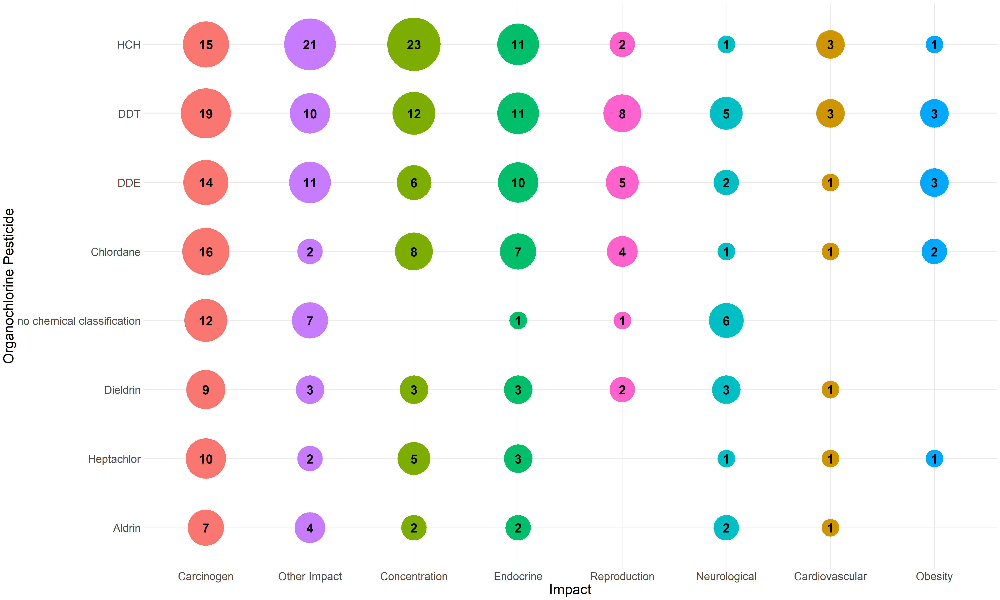

```r
 ggsave(here("figures", "fig4.pdf"), width = 40, height = 25, units = "cm", scale = 2, dpi = 800)
 ggsave(here("figures", "fig4.svg "), width = 40, height = 25, units = "cm", scale = 2, dpi = 800)
```

```
## Error in `ggsave()`:
## ! Can't save to C:/Users/khtmo/OneDrive -
##   UNSW/University/PhD_Chapters/ocp_srm/organochlorineSRM_analysis/figures/fig4.svg
##   .
## ℹ Either supply `filename` with a file extension or supply `device`.
```

# Section 3
To investigate global research output and collaboration networks

## Exploratory bibliometric analysis


```r
# Perform bibliometric analysis
bibliometric_analysis <- biblioAnalysis(bib_sco)

# Adjust plot parameters
par(cex=1.5)

# Explore results
plot(bibliometric_analysis)
```

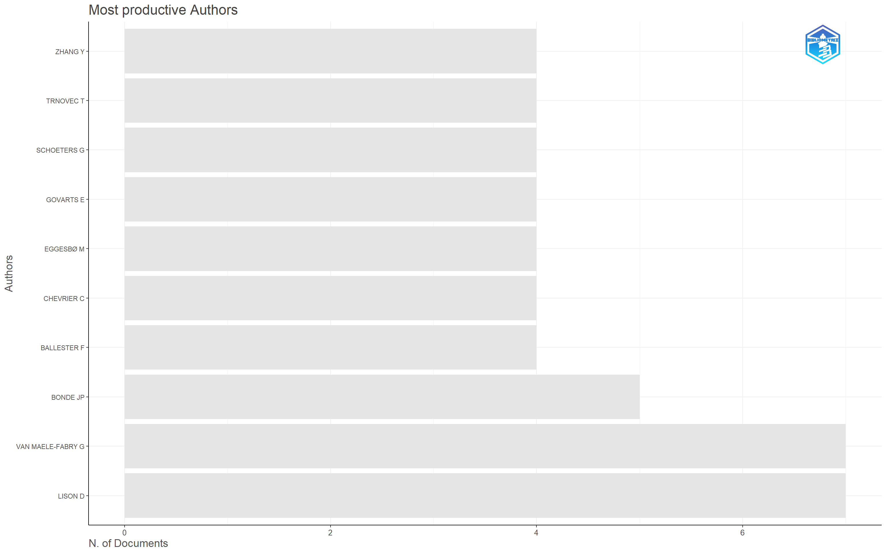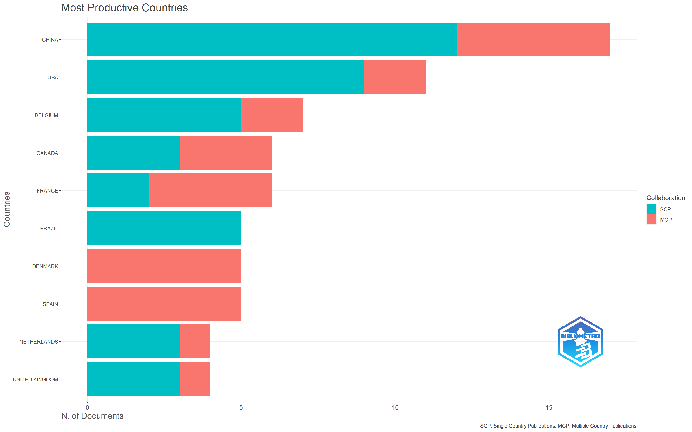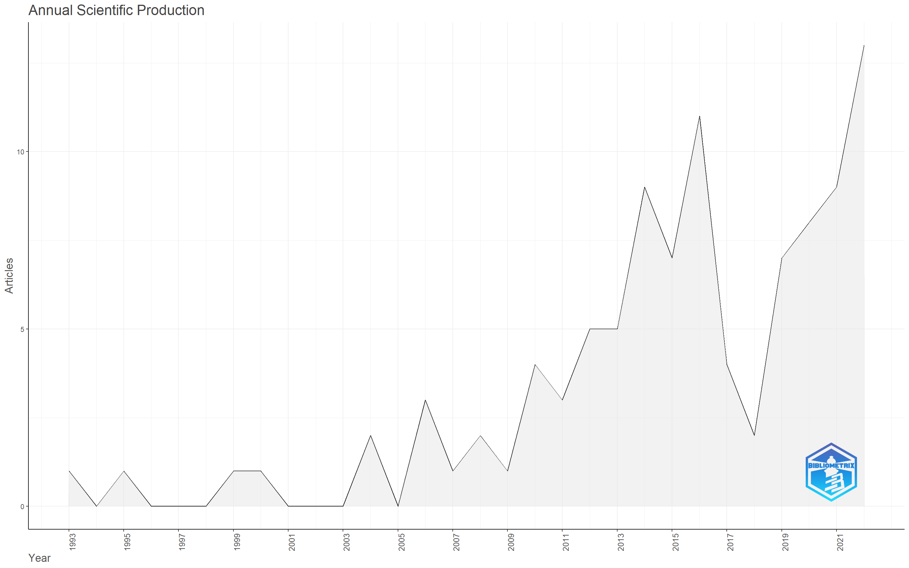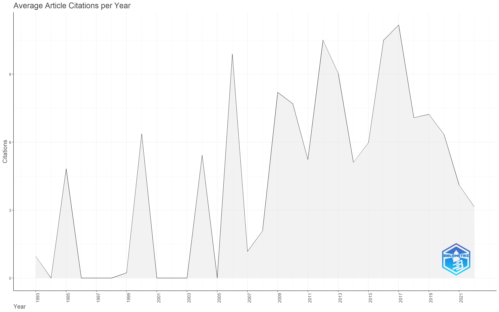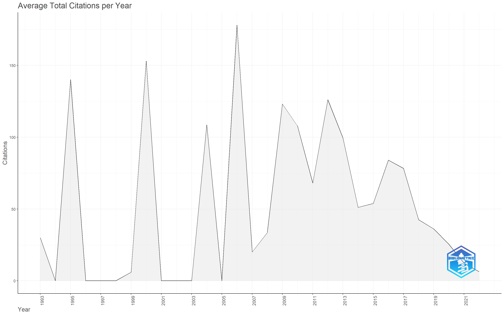

```r
summary(bibliometric_analysis)
```

```
## 
## 
## MAIN INFORMATION ABOUT DATA
## 
##  Timespan                              1993 : 2022 
##  Sources (Journals, Books, etc)        45 
##  Documents                             100 
##  Annual Growth Rate %                  9.25 
##  Document Average Age                  9.78 
##  Average citations per doc             58.6 
##  Average citations per year per doc    5.07 
##  References                            7548 
##  
## DOCUMENT TYPES                     
##  article               50 
##  conference paper      2 
##  review                48 
##  
## DOCUMENT CONTENTS
##  Keywords Plus (ID)                    1592 
##  Author's Keywords (DE)                258 
##  
## AUTHORS
##  Authors                               544 
##  Author Appearances                    684 
##  Authors of single-authored docs       1 
##  
## AUTHORS COLLABORATION
##  Single-authored docs                  1 
##  Documents per Author                  0.184 
##  Co-Authors per Doc                    6.84 
##  International co-authorships %        41 
##  
## 
## Annual Scientific Production
## 
##  Year    Articles
##     1993        1
##     1995        1
##     1999        1
##     2000        1
##     2004        2
##     2006        3
##     2007        1
##     2008        2
##     2009        1
##     2010        4
##     2011        3
##     2012        5
##     2013        5
##     2014        9
##     2015        7
##     2016       11
##     2017        4
##     2018        2
##     2019        7
##     2020        8
##     2021        9
##     2022       13
## 
## Annual Percentage Growth Rate 9.25 
## 
## 
## Most Productive Authors
## 
##       Authors        Articles    Authors        Articles Fractionalized
## 1  LISON D                  7 LISON D                             2.000
## 2  VAN MAELE-FABRY G        7 VAN MAELE-FABRY G                   2.000
## 3  BONDE JP                 5 DAVIS WJ                            1.000
## 4  BALLESTER F              4 GAMET-PAYRASTRE L                   0.867
## 5  CHEVRIER C               4 KREWSKI D                           0.867
## 6  EGGESBØ M                4 HOET P                              0.833
## 7  GOVARTS E                4 FU X                                0.750
## 8  SCHOETERS G              4 MUÑOZ CC                            0.750
## 9  TRNOVEC T                4 VERMEIREN P                         0.750
## 10 ZHANG Y                  4 LEVY LS                             0.700
## 
## 
## Top manuscripts per citations
## 
##                                       Paper                                      DOI  TC TCperYear  NTC
## 1  BROWN TP, 2006, ENVIRON HEALTH PERSPECT           10.1289/ehp.8095                329     16.45 1.85
## 2  GOVARTS E, 2012, ENVIRON HEALTH PERSPECT          10.1289/ehp.1103767             228     16.29 1.81
## 3  PEZZOLI G, 2013, NEUROLOGY                        10.1212/WNL.0b013e318294b3c8    207     15.92 2.08
## 4  BONDE JP, 2016, HUM REPROD UPDATE                 10.1093/HUMUPD/DMW036           188     18.80 2.24
## 5  RIGÉT F, 2010, SCI TOTAL ENVIRON                  10.1016/j.scitotenv.2009.07.036 162     10.12 1.50
## 6  VAN DER MARK M, 2012, ENVIRON HEALTH PERSPECT     10.1289/ehp.1103881             161     11.50 1.28
## 7  OJAJÄRVI IA, 2000, OCCUP ENVIRON MED              10.1136/oem.57.5.316            153      5.88 1.00
## 8  SCHINASI L, 2014, INT J ENVIRON RES PUBLIC HEALTH 10.3390/ijerph110404449         148     12.33 2.90
## 9  SONG Y, 2016, J DIABETES                          10.1111/1753-0407.12325         140     14.00 1.67
## 10 ADAMI HO, 1995, CANCER CAUSES CONTROL             10.1007/BF00054165              140      4.52 1.00
## 
## 
## Corresponding Author's Countries
## 
##           Country Articles   Freq SCP MCP MCP_Ratio
## 1  CHINA                17 0.1753  12   5     0.294
## 2  USA                  11 0.1134   9   2     0.182
## 3  BELGIUM               7 0.0722   5   2     0.286
## 4  CANADA                6 0.0619   3   3     0.500
## 5  FRANCE                6 0.0619   2   4     0.667
## 6  BRAZIL                5 0.0515   5   0     0.000
## 7  DENMARK               5 0.0515   0   5     1.000
## 8  SPAIN                 5 0.0515   0   5     1.000
## 9  NETHERLANDS           4 0.0412   3   1     0.250
## 10 UNITED KINGDOM        4 0.0412   3   1     0.250
## 
## 
## SCP: Single Country Publications
## 
## MCP: Multiple Country Publications
## 
## 
## Total Citations per Country
## 
##      Country      Total Citations Average Article Citations
## 1  DENMARK                    687                     137.4
## 2  USA                        686                      62.4
## 3  CHINA                      607                      35.7
## 4  UNITED KINGDOM             567                     141.8
## 5  BELGIUM                    488                      69.7
## 6  CANADA                     417                      69.5
## 7  FRANCE                     389                      64.8
## 8  NETHERLANDS                259                      64.8
## 9  ITALY                      207                     207.0
## 10 SPAIN                      181                      36.2
## 
## 
## Most Relevant Sources
## 
##                                  Sources        Articles
## 1  ENVIRONMENTAL HEALTH PERSPECTIVES                  10
## 2  SCIENCE OF THE TOTAL ENVIRONMENT                    9
## 3  ENVIRONMENT INTERNATIONAL                           7
## 4  CANCER CAUSES AND CONTROL                           5
## 5  ENVIRONMENTAL RESEARCH                              5
## 6  ENVIRONMENTAL SCIENCE AND POLLUTION RESEARCH        5
## 7  ENVIRONMENTAL SCIENCE AND TECHNOLOGY                4
## 8  SCIENTIFIC REPORTS                                  4
## 9  CHEMOSPHERE                                         3
## 10 ENVIRONMENTAL POLLUTION                             3
## 
## 
## Most Relevant Keywords
## 
##    Author Keywords (DE)      Articles Keywords-Plus (ID)     Articles
## 1      META-ANALYSIS               43 ENVIRONMENTAL EXPOSURE       92
## 2      PESTICIDES                  28 HUMAN                        84
## 3      SYSTEMATIC REVIEW           18 PESTICIDE                    79
## 4      OCCUPATIONAL EXPOSURE        8 HUMANS                       71
## 5      DDT                          7 FEMALE                       70
## 6      CHILD                        6 META ANALYSIS                64
## 7      DDE                          5 PESTICIDES                   60
## 8      BREAST CANCER                4 OCCUPATIONAL EXPOSURE        57
## 9      INSECTICIDES                 4 MALE                         56
## 10     ORGANOCHLORINES              4 PRIORITY JOURNAL             53
```

```r
str(bibliometric_analysis)
```

```
## List of 26
##  $ Articles            : int 100
##  $ Authors             : 'table' int [1:544(1d)] 7 7 5 4 4 4 4 4 4 4 ...
##   ..- attr(*, "dimnames")=List of 1
##   .. ..$ AU: chr [1:544] "LISON D" "VAN MAELE-FABRY G" "BONDE JP" "BALLESTER F" ...
##  $ AuthorsFrac         :'data.frame':	544 obs. of  2 variables:
##   ..$ Author   : chr [1:544] "LISON D" "VAN MAELE-FABRY G" "DAVIS WJ" "GAMET-PAYRASTRE L" ...
##   ..$ Frequency: num [1:544] 2 2 1 0.867 0.867 ...
##  $ FirstAuthors        : chr [1:100] "LAMAT H" "YIPEI Y" "MOTA TFM" "HE H" ...
##  $ nAUperPaper         : int [1:100] 8 7 4 6 5 6 2 5 5 2 ...
##  $ Appearances         : int 684
##  $ nAuthors            : int 544
##  $ AuMultiAuthoredArt  : int 543
##  $ AuSingleAuthoredArt : int 1
##  $ MostCitedPapers     :'data.frame':	100 obs. of  5 variables:
##   ..$ Paper         : chr [1:100] "BROWN TP, 2006, ENVIRON HEALTH PERSPECT" "GOVARTS E, 2012, ENVIRON HEALTH PERSPECT" "PEZZOLI G, 2013, NEUROLOGY" "BONDE JP, 2016, HUM REPROD UPDATE" ...
##   ..$ DOI           : chr [1:100] "10.1289/ehp.8095" "10.1289/ehp.1103767" "10.1212/WNL.0b013e318294b3c8" "10.1093/HUMUPD/DMW036" ...
##   ..$ TC            : num [1:100] 329 228 207 188 162 161 153 148 140 140 ...
##   ..$ TCperYear     : num [1:100] 16.4 16.3 15.9 18.8 10.1 ...
##   ..$ NTC           : num [1:100] 1.85 1.81 2.08 2.24 1.5 ...
##  $ Years               : num [1:100] 2022 2022 2022 2022 2022 ...
##  $ FirstAffiliation    : chr [1:100] "UNIVERSITÉ CLERMONT AUVERGNE" "PEKING UNIVERSITY HEALTH SCIENCE CENTER" "UNIVERSIDADE ESTADUAL DO PARANÁ (UNESPAR)" "ANHUI MEDICAL UNIVERSITY" ...
##  $ Affiliations        : 'table' int [1:289(1d)] 7 7 6 6 6 5 5 5 5 5 ...
##   ..- attr(*, "dimnames")=List of 1
##   .. ..$ AFF: chr [1:289] "UNIVERSITÉ CATHOLIQUE DE LOUVAIN" "UNIVERSITY OF COPENHAGEN" "HUAZHONG UNIVERSITY OF SCIENCE AND TECHNOLOGY" "IMPERIAL COLLEGE LONDON" ...
##  $ Aff_frac            :'data.frame':	289 obs. of  2 variables:
##   ..$ Affiliation: chr [1:289] "UNIVERSITÉ CATHOLIQUE DE LOUVAIN" "HUAZHONG UNIVERSITY OF SCIENCE AND TECHNOLOGY" "UNIVERSIDADE FEDERAL DO PARANÁ" "UNIVERSITY OF OTTAWA" ...
##   ..$ Frequency  : num [1:289] 4.67 2.67 2 1.89 1.5 ...
##  $ CO                  : chr [1:100] "FRANCE" "CHINA" "BRAZIL" "CHINA" ...
##  $ Countries           : 'table' int [1:28(1d)] 17 11 7 6 6 5 5 5 4 4 ...
##   ..- attr(*, "dimnames")=List of 1
##   .. ..$ Tab: chr [1:28] "CHINA" "USA" "BELGIUM" "CANADA" ...
##  $ CountryCollaboration:'data.frame':	28 obs. of  3 variables:
##   ..$ Country: chr [1:28] "CHINA" "USA" "BELGIUM" "CANADA" ...
##   ..$ SCP    : num [1:28] 12 9 5 3 2 5 0 0 3 3 ...
##   ..$ MCP    : num [1:28] 5 2 2 3 4 0 5 5 1 1 ...
##  $ TotalCitation       : num [1:100] 4 1 3 4 8 2 22 11 1 1 ...
##  $ TCperYear           : num [1:100] 1 0.25 0.75 1 2 0.5 5.5 2.75 0.25 0.25 ...
##  $ Sources             : 'table' int [1:45(1d)] 10 9 7 5 5 5 4 4 3 3 ...
##   ..- attr(*, "dimnames")=List of 1
##   .. ..$ SO: chr [1:45] "ENVIRONMENTAL HEALTH PERSPECTIVES" "SCIENCE OF THE TOTAL ENVIRONMENT" "ENVIRONMENT INTERNATIONAL" "CANCER CAUSES AND CONTROL" ...
##  $ DE                  : 'table' int [1:258(1d)] 43 28 18 8 7 6 5 4 4 4 ...
##   ..- attr(*, "dimnames")=List of 1
##   .. ..$ Tab: chr [1:258] "META-ANALYSIS" "PESTICIDES" "SYSTEMATIC REVIEW" "OCCUPATIONAL EXPOSURE" ...
##  $ ID                  : 'table' int [1:1592(1d)] 92 84 79 71 70 64 60 57 56 53 ...
##   ..- attr(*, "dimnames")=List of 1
##   .. ..$ Tab: chr [1:1592] "ENVIRONMENTAL EXPOSURE" "HUMAN" "PESTICIDE" "HUMANS" ...
##  $ Documents           : 'table' int [1:3(1d)] 50 2 48
##   ..- attr(*, "dimnames")=List of 1
##   .. ..$ : chr [1:3] "ARTICLE              " "CONFERENCE PAPER     " "REVIEW               "
##  $ IntColl             : num 41
##  $ nReferences         : int 7548
##  $ DB                  : chr "SCOPUS"
##  - attr(*, "class")= chr "bibliometrix"
```

## Bar plot of most productive countries
Most productive countries for meta-analyses included in the systematic review map Blue is for single country publications (i.e., countries with authors from a single country) and red is for multiple country publications (i.e., countries with authors from multiple countries).

```r
# Extract country collaboration information
country_data <- bibliometric_analysis$CountryCollaboration
country_tibble <- as_tibble(country_data)

# Reshape data into long format
country_tibble_long <- country_tibble %>% 
  pivot_longer(cols = c(SCP, MCP), names_to = "Country_Collaboration", values_to = "value")

# Summarize and filter for top ten countries
top_countries <- country_tibble_long %>%
  group_by(Country) %>%
  summarize(Total = sum(value)) %>%
  arrange(desc(Total)) %>%
  slice_head(n = 10)

# Filter original dataset to keep only the top ten countries
country_tibble_long_filtered <- country_tibble_long %>%
  filter(Country %in% top_countries$Country)

# Create stacked bar plot
bar_plot_countries <- ggplot(country_tibble_long_filtered, aes(fill = Country_Collaboration, y = value, x = Country)) +
  geom_bar(position = "stack", stat = "identity") +
  coord_flip() +
  organochlorTHEME()

bar_plot_countries
```


```r
# ggsave(here("figures", "bar_plot_countries.pdf"), width = 25, height = 15, units = "cm", scale = 2, dpi = 800)
# ggsave(here("figures", "bar_plot_countries.svg"), width = 25, height = 15, units = "cm", scale = 2, dpi = 800)
```

##  Bar plot of top authors


```r
authors_data <- bibliometric_analysis$Authors
authors_tibble <- as_tibble(authors_data)

# Slice top 10 authors
authors_tibble_filtered <- authors_tibble %>%
  slice_head(n = 10)

bar_plot_authors <- ggplot(authors_tibble_filtered, aes(y = n, x = reorder(AU, n))) +
  geom_bar(stat = "identity", width = 0.8, alpha = 0.7, fill = "#1b9e77") +
  geom_text(aes(label = n, y = n/2), hjust = 0.5, color = "black", size = 10) +
  coord_flip() +
  organochlorTHEME()

bar_plot_authors
```

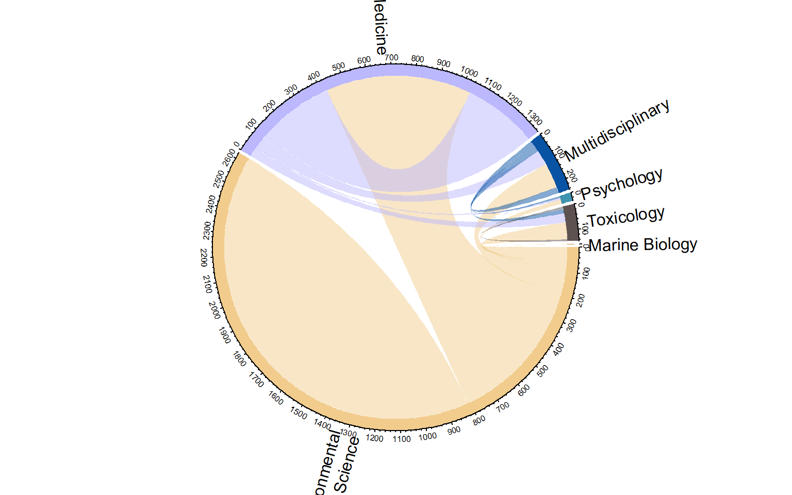

```r
# ggsave(here("figures", "bar_plot_top_authors.pdf"), width = 25, height = 15, units = "cm", scale = 2, dpi = 800)
# ggsave(here("figures", "bar_plot_top_authors.svg"), width = 25, height = 15, units = "cm", scale = 2, dpi = 800)
```

## Figure 5
Heat map of world showing the country-level counts for first authors’ country of affiliation of meta-analysis investigating the impacts of organochlorine pesticides. Grey indicates no publications affiliated with a given country in our data set. 

```r
# Extract country information from the "AU1_CO" and "AU_CO" fields of the "bib_sco" dataset
bibmap <- metaTagExtraction(bib_sco, Field = "AU1_CO", sep = ";") 
bibmap <- metaTagExtraction(bibmap, Field = "AU_CO", sep = ";") 

# Create a data frame with counts of articles from each country
firstcountrycounts <- bibmap %>% 
  group_by(AU1_CO) %>% 
  count() %>% 
  filter(!is.na(AU1_CO))  

# Load world map data and remove countries with longitude >180 to make an equal projection-like map
world_map <- map_data("world") %>% 
  filter(! long > 180)

# Format country names to match regions on the world map
firstcountrycounts$region <- str_to_title(firstcountrycounts$AU1_CO)
firstcountrycounts$region[firstcountrycounts$region == "Usa"] <- "USA" 
firstcountrycounts$region[firstcountrycounts$region == "Korea"] <- "South Korea"
firstcountrycounts$region[firstcountrycounts$region == "United Kingdom"] <- "UK"

# Join count data with map data and set missing counts to zero
emptymap <- tibble(region = unique(world_map$region), n = rep(0,length(unique(world_map$region))))
fullmap <- left_join(emptymap, firstcountrycounts, by = "region")
fullmap$n <- fullmap$n.x + fullmap$n.y
fullmap$n[is.na(fullmap$n)] <- 0

library(tidyverse)
library(RColorBrewer)

# 1. Create 4 count bands that will map cleanly to Dark2’s first 4 colours
fullmap <- fullmap %>% 
  mutate(n_cat = cut(
    n,
    breaks  = c(0, 5, 10, 15, Inf),          # adjust if you prefer other cut‑points
    labels  = c("1–5", "6–10", "11–15", "16–20"),
    right   = TRUE, include.lowest = TRUE
  ))

# 1. recode counts into 5 tidy factor levels (0, 1–5, 6–10, 11–15, 16–20+)
fullmap <- fullmap %>% 
  mutate(
    n_cat = case_when(
      is.na(n) ~ NA_character_,      # keep missing separate
      n == 0  ~ "0",
      n <= 5  ~ "1–5",
      n <= 10 ~ "6–10",
      n <= 15 ~ "11–15",
      TRUE    ~ "16–20"
    ) %>% 
    factor(levels = c("0", "1–5", "6–10", "11–15", "16–20"))  # lock legend order
  )

# 2. define colours: grey for 0, first four Dark2 hues for the rest
fill_cols <- c(
  "0"        = "grey80",
  setNames(brewer.pal(4, "Dark2"), c("1–5", "6–10", "11–15", "16–20"))
)

# 3. build the map
fig5 <- fullmap %>% 
  ggplot(aes(fill = n_cat, map_id = region)) +
  geom_map(map = world_map, colour = "gray50", linewidth = 0.2) +
  expand_limits(x = world_map$long, y = world_map$lat) +
  coord_map("mercator", xlim = c(-180, 180), ylim = c(-50, 90)) +
  scale_fill_manual(
    values   = fill_cols,
    name     = "First‑author count",
    na.value = "white",              # countries not in the data
    drop     = FALSE
  ) +
  theme_void() +
  theme(
    panel.background = element_rect(fill = "white", colour = NA),
    legend.position  = "bottom",
    legend.direction = "horizontal",
    legend.title     = element_text(size = 20, face = "bold"),
    legend.text      = element_text(size = 18),
    legend.key.width = unit(32, "mm"),
    legend.margin    = margin(t = 8)
  ) +
  guides(
    fill = guide_legend(
      title.position = "top",
      title.hjust    = 0.5,
      label.position = "bottom",
      nrow           = 1
    )
  )

fig5
```

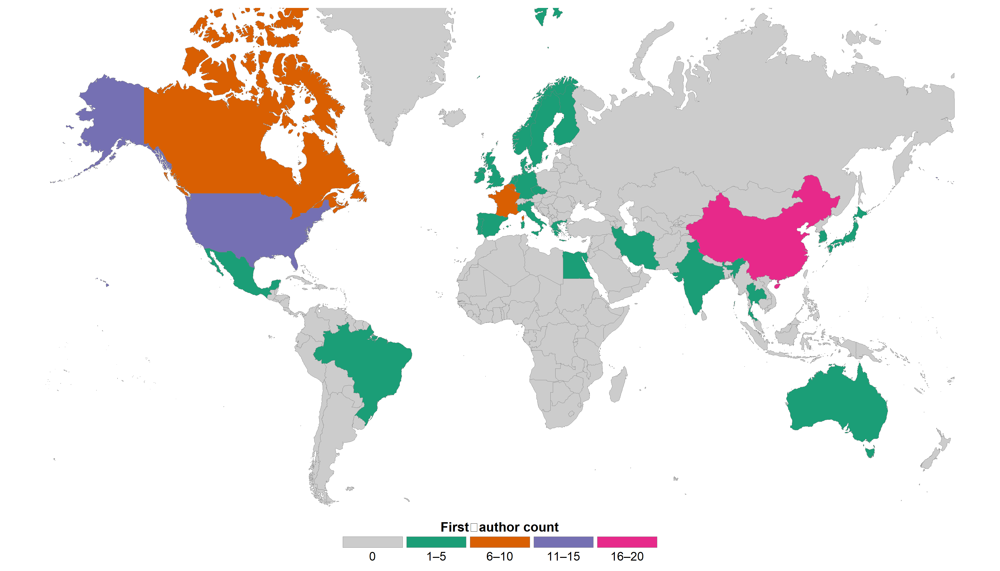

```r
# ggsave(here("figures", "fig5.pdf"), width = 21, height = 12, units = "cm", scale = 2, dpi = 800)
# ggsave(here("figures", "fig5.svg"), width = 21, height = 12, units = "cm", scale = 2, dpi = 800)
```

## Europe map of first-author affiliations
Heat map of Europe showing the country-level counts for first authors’ country of affiliation of meta-analysis investigating the impacts of organochlorine pesticides. Grey indicates no publications affiliated with a given country in our data set. 

```r
heat_map_europe <- fullmap %>%
  ggplot(aes(fill = n, map_id = region)) +
  geom_map(map = world_map, color = "gray50") +
  coord_map("mercator", ylim = c(35, 65), xlim = c(-35, 45)) + 
  theme(
    axis.text = element_blank(),  
    axis.title = element_blank(),  
    legend.box = "horizontal",  
    legend.box.just = "center",  
    legend.margin = margin(t = 10, unit = "pt"),  
    legend.text = element_text(size = 16),  
    legend.title = element_text(size = 18, face = "bold"),  
    legend.key.width = unit(30, "mm"),
    legend.position = "bottom",
    panel.background = element_rect(fill = "white")
  ) +
  scale_fill_gradient(
    low = "#98FB98", high = "#006400",
    name = "First Author Count", na.value = "gray70",
    limits = c(1, 10), breaks = seq(0, 10, length.out = 6)
  )

heat_map_europe
```

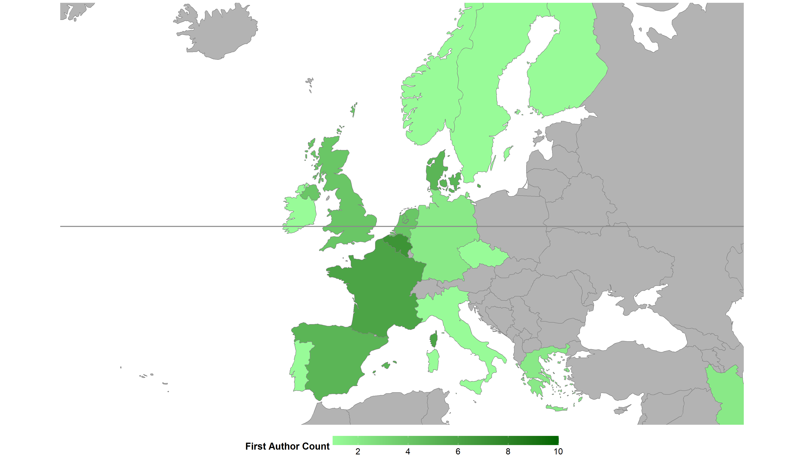

```r
# ggsave(here("figures", "heat_map_europe_authors.pdf"), width = 25, height = 15, units = "cm", scale = 2, dpi = 800)
# ggsave(here("figures", "heat_map_europe_authors.svg"), width = 25, height = 15, units = "cm", scale = 2, dpi = 800)
```


## Chord diagram of country collaborations
Chord diagram of collaborations across countries. Countries represent the location of the primary authors’ affiliated institution. 

```r
svg(filename = here("figures", "chord_diagram_country_collaborations.svg"),
    width = 8, height = 8)   # inches are easier to reason about than pixels

# ── 1. Build collaboration matrix ────────────────────────────────────────────
bib_sco2 <- metaTagExtraction(bib_sco, Field = "AU_CO", sep = ";")
NetMatrix_country <- biblioNetwork(bib_sco2,
                                   analysis = "collaboration",
                                   network  = "countries",
                                   sep      = ";") |>
                     as.matrix()

# keep only upper‑triangle to avoid double counts
NetMatrix_country[lower.tri(NetMatrix_country)] <- 0  

# ── 2. Standardise country names ─────────────────────────────────────────────
# (add more replacements if you spot variants)
clean_names <- function(x) {
  x <- str_to_title(x)
  x[x == "Usa"]             <- "USA"
  x[x == "United Kingdom"]   <- "UK"
  x
}
colnames(NetMatrix_country) <- clean_names(colnames(NetMatrix_country))
rownames(NetMatrix_country) <- clean_names(rownames(NetMatrix_country))

# ── 3. Plot ──────────────────────────────────────────────────────────────────
circos.clear()  # start fresh in case we’re re‑running

circos.par(
  start.degree   = 90,                 # top‑centre
  gap.degree     = 4,                  # more space between sectors
  cell.padding   = c(0, 0, 0, 0),
  track.margin   = c(0, 0),
  canvas.xlim    = c(-1.15, 1.15),     # nudge out a touch for labels
  canvas.ylim    = c(-1.15, 1.15)
)

# pre‑allocate a label track a little wider than default
chordDiagram(
  NetMatrix_country,
  annotationTrack = "grid",
  preAllocateTracks = list(track.height = mm_h(5))
)

# add country labels
circos.trackPlotRegion(
  track.index = 1, bg.border = NA,
  panel.fun = function(x, y) {
    sector.name <- get.cell.meta.data("sector.index")
    xlim        <- get.cell.meta.data("xlim")
    ylim        <- get.cell.meta.data("ylim")
    # put text just outside the grid line
    circos.text(
      x         = mean(xlim),
      y         = ylim[2] + mm_y(1.5),
      labels    = sector.name,
      facing    = "clockwise",
      niceFacing= TRUE,
      adj       = c(0, 0),
      cex       = 0.55               # shrink a little so every name fits
    )
    # optional axis ticks (comment out if you don’t need them)
    circos.axis(
      h                 = "top",
      sector.index      = sector.name,
      track.index       = 2,
      major.tick.length = 0.15,
      labels.cex        = 0.4
    )
  }
)

dev.off()
```

```
## png 
##   2
```

## Chord diagram (no within-country collaborations)
Chord diagram illustration of collaborations across countries. Countries represent the location of the primary authors’ affiliated institution. Collaborations within countries are not shown.

```r
# ── 1. Build (or re‑use) the collaboration matrix ───────────────────────────
bib_sco2 <- metaTagExtraction(bib_sco, Field = "AU_CO", sep = ";")
NetMatrix_country <- biblioNetwork(bib_sco2,
                                   analysis = "collaboration",
                                   network  = "countries",
                                   sep      = ";") |>
                     as.matrix()

# keep only upper‑triangle to avoid double counts
NetMatrix_country[lower.tri(NetMatrix_country)] <- 0  

# drop within‑country ties
diag(NetMatrix_country) <- 0

# ── 2. Standardise country names (add more if you need) ──────────────────────
clean_names <- function(x) {
  x <- str_to_title(x)
  x[x == "Usa"]             <- "USA"
  x[x == "United Kingdom"]   <- "UK"
  x
}
colnames(NetMatrix_country) <- clean_names(colnames(NetMatrix_country))
rownames(NetMatrix_country) <- clean_names(rownames(NetMatrix_country))

# ── 3. SVG output ────────────────────────────────────────────────────────────
svg(filename = here("figures", "chord_diagram_no_within_country.svg"),
    width = 8, height = 8)          # inches

circos.clear()

circos.par(
  start.degree   = 90,
  gap.degree     = 4,
  cell.padding   = c(0, 0, 0, 0),
  track.margin   = c(0, 0),
  canvas.xlim    = c(-1.15, 1.15),
  canvas.ylim    = c(-1.15, 1.15)
)

chordDiagram(
  NetMatrix_country,
  annotationTrack = "grid",
  preAllocateTracks = list(track.height = mm_h(5))
)

circos.trackPlotRegion(
  track.index = 1, bg.border = NA,
  panel.fun = function(x, y) {
    sn   <- get.cell.meta.data("sector.index")
    xl   <- get.cell.meta.data("xlim")
    yl   <- get.cell.meta.data("ylim")
    circos.text(
      mean(xl),
      yl[2] + mm_y(1.5),            # nudge outside ring
      sn,
      facing     = "clockwise",
      niceFacing = TRUE,
      adj        = c(0, 0),
      cex        = 0.55
    )
    circos.axis(
      h                 = "top",
      sector.index      = sn,
      track.index       = 2,
      major.tick.length = 0.15,
      labels.cex        = 0.4
    )
  }
)

dev.off()
```

```
## png 
##   2
```

```r
# ── 4. OPTIONAL
```

## Figure 5b
Chord diagram illustration of collaborations across continents. Continents represent the location of the primary authors’ affiliated institution. Collaborations within countries are not shown.

```r
# ── libraries ────────────────────────────────────────────────────────────────
library(circlize)
library(dplyr)

# ── 1. country → continent recode  (same as before) ─────────────────────────
continent_key <- c(
  # North America
  "USA" = "North America", "Canada" = "North America", "Costa Rica" = "North America",
  # Europe
  "Spain" = "Europe", "France" = "Europe", "Denmark" = "Europe", "Netherlands" = "Europe",
  "Belgium" = "Europe", "UK" = "Europe", "Germany" = "Europe", "Finland" = "Europe",
  "Greece" = "Europe", "Norway" = "Europe", "Sweden" = "Europe", "Italy" = "Europe",
  "Portugal" = "Europe", "Switzerland" = "Europe", "Czech Republic" = "Europe",
  "Iceland" = "Europe", "Ireland" = "Europe", "Romania" = "Europe",
  "Slovakia" = "Europe", "Ukraine" = "Europe",
  # Asia
  "China" = "Asia", "Korea" = "Asia", "Japan" = "Asia", "Hong Kong" = "Asia",
  "Turkey" = "Asia", "India" = "Asia", "Iran" = "Asia", "Kazakhstan" = "Asia",
  # Other
  "Australia" = "Other", "Brazil" = "Other", "Egypt" = "Other"
)

NetMatrix_continent <- NetMatrix_country
colnames(NetMatrix_continent) <- recode(colnames(NetMatrix_continent),
                                        !!!continent_key,
                                        .default = colnames(NetMatrix_continent))
rownames(NetMatrix_continent) <- recode(rownames(NetMatrix_continent),
                                        !!!continent_key,
                                        .default = rownames(NetMatrix_continent))

# ── 2. collapse duplicates & tidy ────────────────────────────────────────────
merge_matrix  <- t(rowsum(t(NetMatrix_continent),
                          group = colnames(NetMatrix_continent), na.rm = TRUE))
merge_matrix2 <- rowsum(merge_matrix, group = rownames(merge_matrix))
diag(merge_matrix2) <- 0  # no self‑links

continent_order <- c("North America", "Europe", "Asia", "Other")
merge_matrix2   <- merge_matrix2[continent_order, continent_order]

# ── 3. palette ───────────────────────────────────────────────────────────────
continent_cols <- c("Asia"          = "#1B9E77",
                    "Europe"        = "#D95F02",
                    "North America" = "#7570B3",
                    "Other"         = "#E6AB02")

# ── 4. helper: totals per continent ─────────────────────────────────────────
totals <- rowSums(merge_matrix2) + colSums(merge_matrix2)

# ── 5. plotting parameters ──────────────────────────────────────────────────
show_link_labels   <- TRUE          # set FALSE if you don’t want flow labels
link_label_cutoff  <- 0.10          # fraction of max to label (e.g. top 10 %)

# ── 5. plotting ─────────────────────────────────────────────────────────────
pdf("figures/fig5b.pdf", width = 15, height = 15)
```

```
## Error in pdf("figures/fig5b.pdf", width = 15, height = 15): cannot open file 'figures/fig5b.pdf'
```

```r
circos.clear()
circos.par(start.degree = 90,
           gap.after    = c(4, 4, 4, 10),
           track.margin = c(0.01, 0.01))

# allocate a single, thicker outer track for the ring
chordDiagram(
  merge_matrix2,
  grid.col          = continent_cols,
  transparency      = 0.25,
  annotationTrack   = "grid",
  preAllocateTracks = list(track.height = uh(12, "mm"))  # just one track now
)

## continent names — closer & larger ----------------------------------------
circos.trackPlotRegion(track.index = 1, panel.fun = function(x, y) {
  sector <- get.cell.meta.data("sector.index")
  circos.text(
    x      = get.cell.meta.data("xcenter"),
    y      = get.cell.meta.data("ylim")[2] + mm_y(0),  # ← closer (was + mm_y(2))
    labels = sector,
    facing = "bending.outside", niceFacing = TRUE,
    cex    = 3,   # ← larger (was 1.4)
    font   = 2,
    col    = "black"
  )
}, bg.border = NA)
```

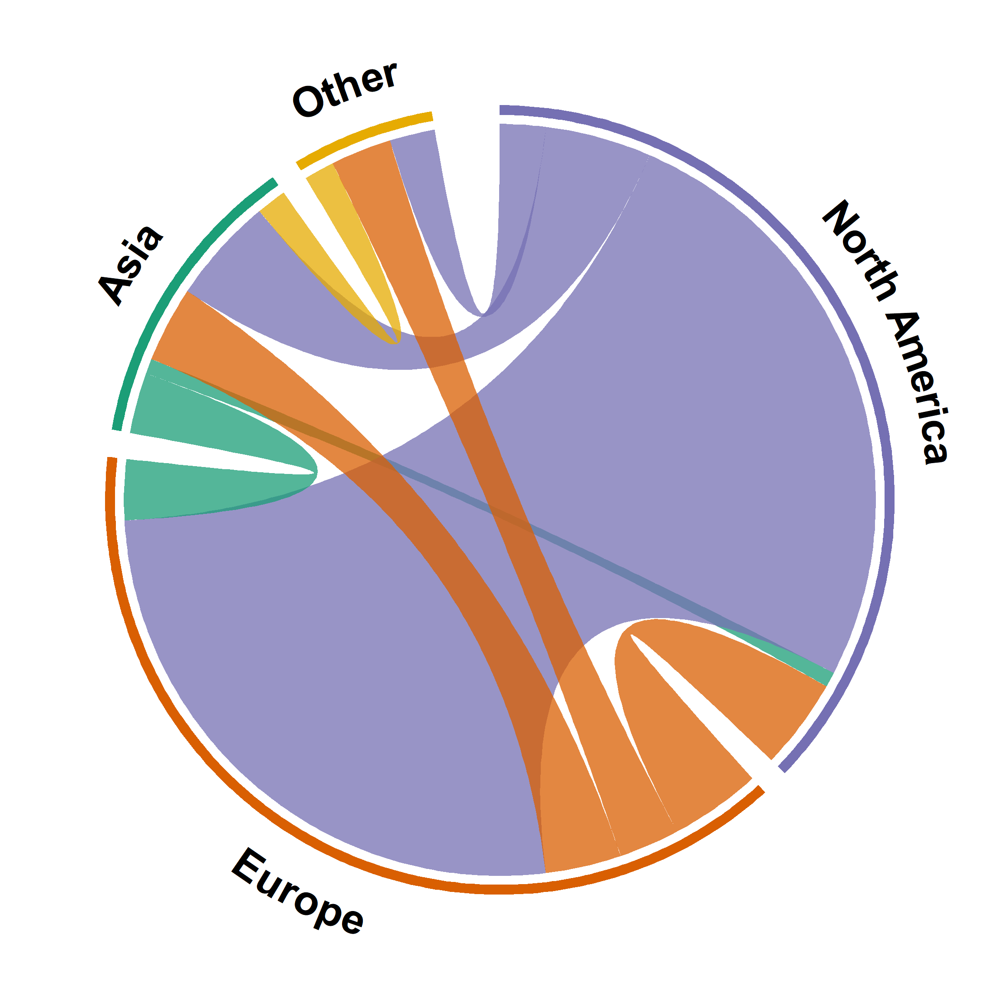

```r
dev.off()
```

```
## null device 
##           1
```

```r
circos.clear()
```

## Chord diagram of collaborations across continents
Chord diagram illustration of collaborations across disciplines. Disciplines have been allocated based on the Journal Citation Categories on Web of Science. Collaborations within disciplines are not shown.

```r
# Copy the country matrix into a “continent” matrix
NetMatrix_continent <- NetMatrix_country

# Rename countries to continents
colnames(NetMatrix_continent)[colnames(NetMatrix_continent) == "Usa"] <- "North America"
rownames(NetMatrix_continent)[rownames(NetMatrix_continent) == "Usa"] <- "North America"

colnames(NetMatrix_continent)[colnames(NetMatrix_continent) == "Spain"] <- "Europe"
rownames(NetMatrix_continent)[rownames(NetMatrix_continent) == "Spain"] <- "Europe"

# ... (remainder of your renaming for each country → continent) ...

# Collapse into summed continents matrix
merge_matrix   <- t(rowsum(t(NetMatrix_continent), group = colnames(NetMatrix_continent), na.rm = TRUE))
merge_matrix2  <- rowsum(merge_matrix, group = rownames(merge_matrix))
diag(merge_matrix2) <- 0  # remove diagonal if you do not want within-continent collaborations

# Create the chord diagram
chordDiagramFromMatrix(merge_matrix2)
```

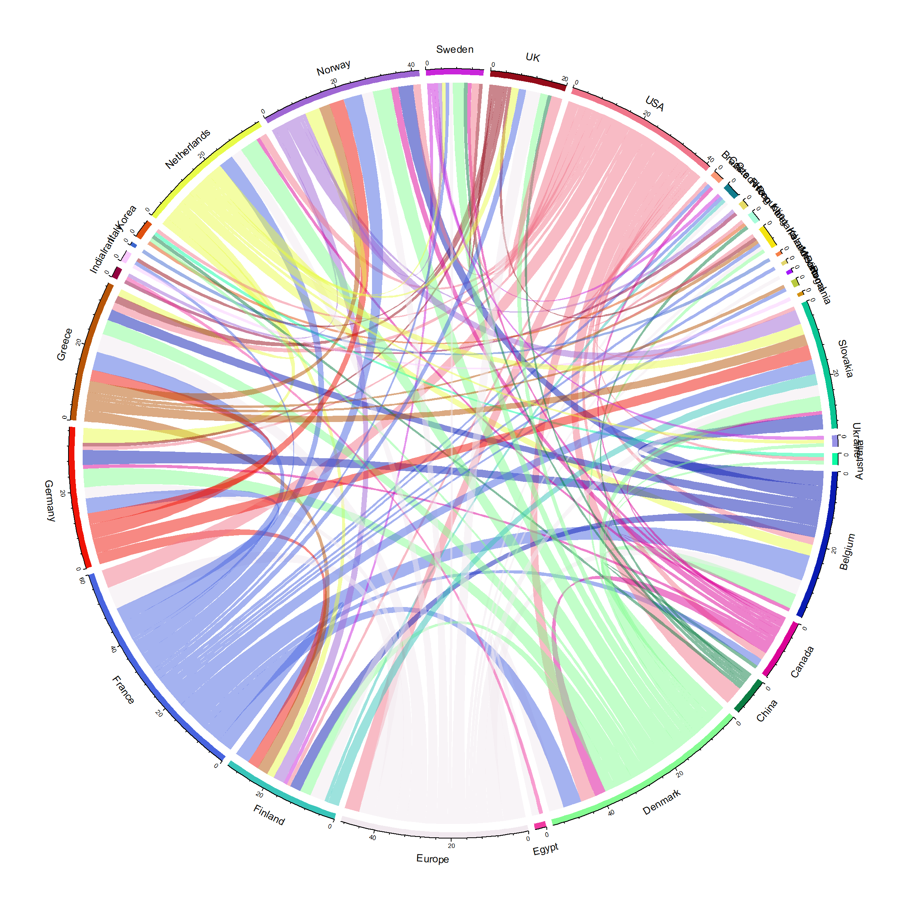

```r
# Optionally define color palette
my_colors <- c("#1B9E77", "#D95F02", "#7570B3", "#E6AB02")
my_colors <- rep(my_colors, length.out = ncol(merge_matrix2))

jpeg("figures/continent_chord_diagram.jpg", width = 25, height = 25, units = "cm", res = 300)
```

```
## Error in jpeg("figures/continent_chord_diagram.jpg", width = 25, height = 25, : unable to start jpeg() device
```

```r
# Draw chord diagram with some styling
chordDiagram(merge_matrix2, 
             annotationTrack = "grid", 
             annotationTrackHeight = mm_h(7), 
             preAllocateTracks = 1,
             grid.col = my_colors)

# Add track to label each sector
circos.trackPlotRegion(track.index = 1, panel.fun = function(x, y) {
  xlim       = get.cell.meta.data("xlim")
  ylim       = get.cell.meta.data("ylim")
  sector.name= get.cell.meta.data("sector.index")
  circos.text(mean(xlim), ylim[1], sector.name, 
              facing = "bending.inside", niceFacing = TRUE, 
              adj = c(0.5, 1.75), col = "white", cex = 1.2)
}, bg.border = NA)
```

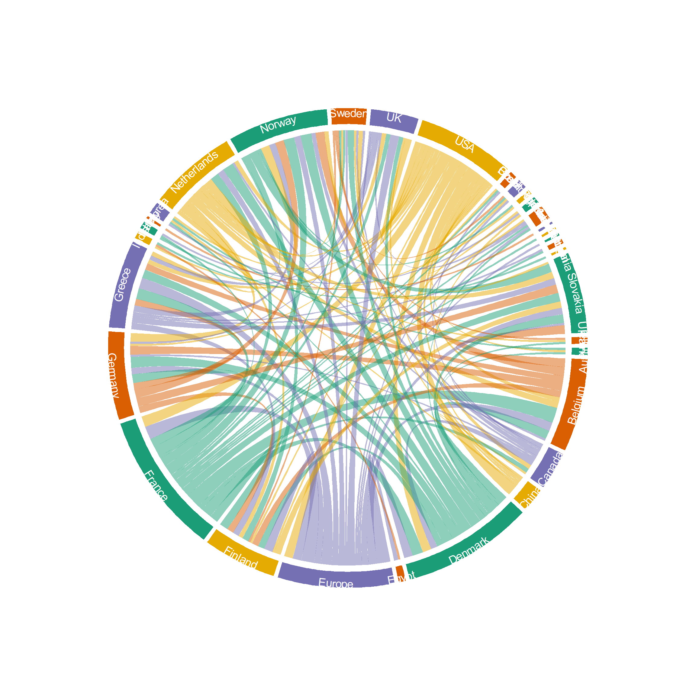

```r
dev.off()
```

```
## null device 
##           1
```

